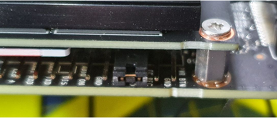

.. _device:

Device
##############

Jetson Xavier
*************************

1. Flash Jetson with SDKmanager

    Reference: https://wiki.seeedstudio.com/reComputer_A205_Flash_System/?fbclid=IwAR3Ucwjhkz-ELN7gNlXeVyLbQyA1-_JJOZOrvIwZwNmHF2buaZtF7fjmx9s

    https://www.stereolabs.com/blog/getting-started-with-jetson-xavier-nx/?fbclid=IwAR3ti7579uFsYLJphyBymdAImoLOhFE4j9MA7Gtz0EJ_jFvE-su6ZSi8LjM

    - Download SDKmanager

        - The most recent version of NVIDIA SDK Manager can be downloaded from https://developer.nvidia.com/drive/sdk-manager

        - Install the Debian package

            .. code-block:: bash

                sudo apt install ./sdkmanager_[version]-[build]_[arch].deb

            .. note:: 

                where [version], [build] and [arch] represent the current version, the build number and the architecture of SDK Manager. You can see it in the downloaded file. (e.g. sdkmanager_1.1.0-6343_amd64.deb).

        - Log In and Run SDK Manager follow here: https://docs.nvidia.com/sdk-manager/download-run-sdkm/index.html#download-run

    - Run NVIDIA SDK Manager

        .. code-block:: bash

            sdkmanager

        Select the NVIDIA DEVELOPER tab, enter your developer credentials and click Login

|

    - Select your Development Environment

        select the board to flash, the version of the operating system and additional SDKs to be installed.

|

    - Launch the Jetson OS Install

        Before the installation can begin, you will need to enter your sudo password. The SDK Manager will then display the progress of the download and software installation.

|

    - Installing system & Hardware Setup 

        SDK Manager supports two options to put your Jetson target into Force Recovery Mode. We understand the operation of Jetson-202 Carrier Board into force recovery mode and have already been in force recovery mode in the previous steps. So we select 

        Manual setup: set the target to Force Recovery Mode via manual operations.

        You can also choose whether to pre-configure the OEM configuration.

        - **Pre-Config**: SDK Manager will flash the target with the predefined configuration, and there is no need to complete the System Configuration Wizard after flashing.

        - **Runtime**: No default configuration is set on the target, and you will need to manually complete the System Configuration Wizard after flashing.

        .. note:: 

            Here, we select the default Pre-Config. 

|

        Following Step in figure above 

        Connect a Micro USB cable to the USB connector.

|

        In step 4 you need to Insert a jumper to connect the PINs #9 and #10 of the connector J14 just under the Xavier NX module to Force Recovery on boot.

|

        After that, enter the name and password of the new Jetson system at the bottom, please keep them in mind.

        When ready, click Flash to continue.

        The display shows the progress of the download and installation of the software. Please wait patiently for the installation to complete.

|

        After a moment, you will be able to see a new window pop up in the NVIDIA SDK Manager, prompting you that you need to connect to your device via IP address. It means the system has been already installed and the components installing will be proceeded

|

In this case, we can pull out the jumper and restart the board. Then we need to connect the board to a monitor via HDMI, enter the password you entered

At this point you need to connect the board to the same LAN as the Linux host PC and determine the IP address of the Jetson by using the command ifconfig.

Go back to the Linux host PC and enter the IP address you just obtained. NVIDIA SDK Manager will try to connect to the Jetson device and proceed to complete the installation of the next SDK components.

|

When you see the following window appear, the installation has been done

|

    - Install Specific library

        - TensorFlow

            - Install system packages required by TensorFlow

                .. code-block:: bash

                    sudo apt-get update
                    sudo apt-get install libhdf5-serial-dev hdf5-tools libhdf5-dev zlib1g-dev zip libjpeg8-dev liblapack-dev libblas-dev gfortran

            - Install and upgrade pip3

                .. code-block:: bash

                    sudo apt-get install python3-pip
                    sudo pip3 install -U pip testresources setuptools==65.5.0

            - Install the Python package dependencies

                .. code-block:: bash

                    sudo pip3 install -U numpy==1.21.1 future==0.18.2 mock==3.0.5 keras_preprocessing==1.1.2 keras_applications==1.0.8 gast==0.4.0 protobuf pybind11 cython pkgconfig packaging h5py==3.6.0

            - Install TensorFlow 2.9.1 using pip3. This command will install the latest version of TensorFlow compatible with JetPack 5.0.2.

                .. code-block:: bash

                    sudo pip3 install --extra-index-url https://developer.download.nvidia.com/compute/redist/jp/v502 tensorflow==2.9.1+nv22.09

        - PyTorch

            - Install system packages required by TensorFlow

                .. code-block:: bash

                    sudo apt-get -y update
                    sudo apt-get -y install autoconf bc build-essential g++-8 gcc-8 clang-8 lld-8 gettext-base gfortran-8 iputils-ping libbz2-dev libc++-dev libcgal-dev libffi-dev libfreetype6-dev libhdf5-dev libjpeg-dev liblzma-dev libncurses5-dev libncursesw5-dev libpng-dev libreadline-dev libssl-dev libsqlite3-dev libxml2-dev libxslt-dev locales moreutils openssl python-openssl rsync scons python3-pip libopenblas-dev

            - Download Pytorch version 1.13.0 here https://developer.download.nvidia.com/compute/redist/jp/v502/pytorch/torch-1.13.0a0+936e9305.nv22.11-cp38-cp38-linux_aarch64.whl

            - Install .whl file package

                .. code-block:: bash

                    cd #(where you've downloaded)
                    pip install torch-1.13.0a0+936e9305.nv22.11-cp38-cp38-linux_aarch64.whl

        - torch vision

            .. code-block:: bash

                sudo apt-get install libjpeg-dev zlib1g-dev libpython3-dev libavcodec-dev libavformat-dev libswscale-dev
                git clone --branch v0.14.0  https://github.com/pytorch/vision
                cd torchvision
                export BUILD_VERSION=0.14.0
                sudo python3 setup.py install
               

Intel Nuc
************

1. Change Karnel of Ubantu 

    - Check current kernel version

        .. code-block:: bash

            uname -r

    - Installing Ubuntu Mainline Kernel Installer

        .. code-block:: bash
            
            sudo add-apt-repository ppa:cappelikan/ppa
            sudo apt update
            sudo apt install mainline

    - Open Mainline and select version to install

|

    - After install complete, reboot Intel NUC

        Open Grub menu on boot and select kernel version of ubantu

|

2. Install Intel realsense SDK follow this document: :ref:`some disadvantages <realsenseInstallation>`:

3. Remote to device

|

    - Remote to Intel NUC with AnyDesk

        We will use AnyDesk to remote the desktop of Intel NUC from your computer.

        - Download Anydesk on your computer: https://anydesk.com/en/downloads/windows

        - Start Intel NUC and open AnkDesk on Intel NUC.

        - Connect the same network wth Intel NUC.

        - On your computer connect to the address of Intel NUC.

|

        - Click accept connect the device on Intel NUC.

        - Remote Intel NUC with your computer has been done.

|

    - Remote to Jetson Xavier 

        - Set up LAN port

            - Intel NUC

|

            - Jetson Xavier

|
        
        - Open VNC Viewer and connect to address 10.42.0.2

|

        - Connect to Jetson Xavier successfully

|

    - SSH to Jetson Xavier via vs code

        For debugging code in Jetson Xavier

        - Download ssh extension on vscode

|

        - Connect ssh to address 10.42.0.2

|

        - Open a new window of ssh target and connect to Jetson Xavier

|