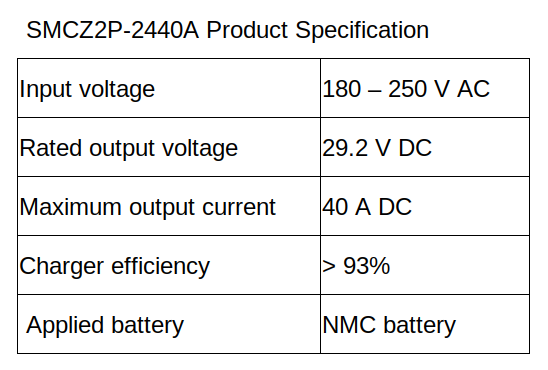

.. _battery_management_system:

Battery Management System
############################

schematic diagram
*****************

.. image:: ./images/3.png
    :width: 480
    :align: center

|

This battery management system comes from a combination of the original battery management system and electrical sensors. Therefore, we can divide this system into 3 parts.

- Multiple-cell battery

    From the performance requirement that the robot's battery operate at full load must last more than 3 hours , charging time about 6 hours and supply continuous current about 60A . First we need to calculate the current load of the fully operational robot. And from the calculations, the results are shown below this table.

.. image:: ./images/3.png
    :width: 480
    :align: center

|

- Battery Voltage level selection

    From the table above, when we know how much power that a robot uses. Then, we will choose the voltage of the battery that we will use with our robot. By selecting voltage we must consider about current flow in the system and the device in the robot.

.. image:: ./images/4.png
    :width: 480
    :align: center

|

    So, we choose a battery with 24V voltage because 12V makes the current in the system flow too high and 48V will make the battery unnecessarily large. But 24V will make the current available in the system meet the set requirements at about 60A.

- Battery capacity selection

    From voltage level selection, we will use a 24V battery with 62.625A supply current at full operation. If we need to use this robot for 3 hours, we will use battery at least 

    Capacity = Current  hours of use = 62.625  3 = 187.875 Ah

.. note:: In this project, we use a custom battery of 220Ah capacity because of store production restrictions.

- Battery type selection

    From the performance requirement that supply continuous current is about 60A and charging time about 6 hours. So, discharge rate and charge rate of the battery is

    .. math:: 

        Discharge rate = \frac{supply current}{capacity} = 62.625187.875 = 0.33 C \\
        Charge rate = \frac{1}{charging time} = 16 = 0.17 C

    In terms of robot usage and its application, it makes us choose to use NMC batteries (Lithium Nickel Manganese Cobalt Oxide Batteries) because NMC batteries have a high specific energy or power. This limitation of either ‘energy’ or ‘power’ makes them more common for use in power tools or electric vehicles. (Specific power is power per unit mass, and specific energy is energy content per unit mass.) 

- Battery characteristics

.. image:: ./images/5.png
    :width: 480
    :align: center

|

    From the table above, the result can be summarized as follows:

    - The NMC battery will fully charge at about 4.15 - 4.2 V.
    - The NMC battery has nominal voltage at about 3.75 - 3.55 V.
    - The NMC battery has a cut-off discharge voltage at below 2.95 V. 

- Number of cells of the battery

    From voltage level selection, we need to use a 24V battery as nominal voltage. So, The number  of cells of the battery is

    .. math:: Number of cells = \frac{Battery pack voltage}{nominal cell voltage}=243.5=6.86 =7 cells 

Summary :

::
    Battery voltage at full charge = full charge cell voltage  number of cells = 4.15 7 = 29.1 V.

    Nominal Battery voltage=Nominal cell voltage  number of cells = 3.55 7 = 24.9 V.

    Cutoff Battery voltage=Cutoff cell voltage  number of cells = 2.95 7 = 20.7 V.
	
- Overcharge / Over Discharge circuit 

    All of the lithium batteries in the world have the same characteristics that when the battery discharges below cut off voltage. The battery will die immediately. Just like the case of Overcharge battery. When we overcharge the battery, the battery may leak, overheat and explode in the end. In order to prevent these situations. We must have a circuit to cut off the battery when the battery approaches cut off voltage and cut off the battery when the battery is at full charge.

- Overcharge protection

.. image:: ./images/6.png
    :width: 480
    :align: center

|

    The image above shows an overcharge protection circuit that consists of battery cells , switch , voltage monitors and discharge resistor that are connected in parallel with the battery cell. When the battery cell is at full charge, the switch in circuit will be closed, making the circuit connect with discharge resistor, causing the current to flow to the discharge resistor instead.

- Over Discharge protection

.. image:: ./images/7.png
    :width: 480
    :align: center

|

    The image above shows an over discharge protection circuit that consists of battery cells, zener diode , transistor and relay. When the battery approaches cut off voltage, the zener diode will be in non-conduction state, making Q1 transistor close . When Q1 closes it makes a voltage difference between Q1 .So Q2 will be open to trigger a relay coil. Contact in relay will be connected to normally close, making cells not connected to load.

- Charging method

    In this robot we choose CC/CV charging method because CC/CV charging is a typical method of charging rechargeable batteries. Operation switches between CC charging, which charges with a constant current, and CV that charges at a constant voltage, depending on the voltage of the rechargeable battery.

.. image:: ./images/8.png
    :width: 480
    :align: center

|

    From this graph, There are 3 phases during charging a battery from 0 to 100 battery percentage.

    - Pre-charge = Charge with a small current. 

    - CC-charging = Charge with a constant current 

    - CV-charging = Charge with a constant voltage

- Charger selection

    From the performance requirement that the robot's charging time must not exceed 6 hours. And NMC battery recommended charge rate is about 0.2C. (44A if calculated from 220Ah capacity) So, we will use a charger with continuous output current at 40A. And the charging method is constant current Constant voltage Full automatic shutdown (CC-CV). Make us choose on-board charger model SMCZ2P-2440A

.. image:: ./images/9.png
    :width: 480
    :align: center

|
    
- Robot’s charging connector selection

    From the charger selection that charger will supply continuous current at 40A. So a connector which is connected between the robot battery and charger must withstand 40A current and be easy to plug. Therefore, we use the XT90S connector which has an anti spark design when connecting.

|

- Battery wire selection

    From maximum load that battery will supply discharge current at 60A. So the wire which is connected to other devices such as R shunt, charging connector and terminal block is High Temperature Resistant Silicone Wire (10AWG).

.. image:: ./images/11.png
    :width: 480
    :align: center

|

