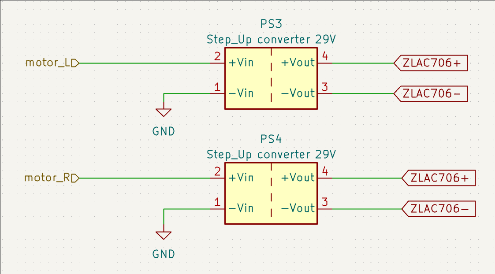
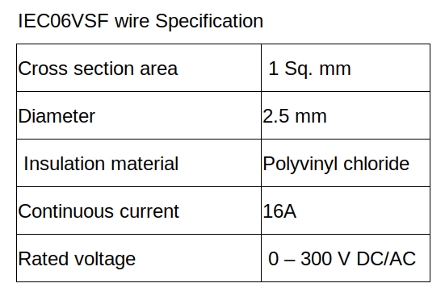

.. _driving_system:

Driving system
#######################

|

Driving system ของเรามีองค์ประกอบหลักอยู่ 3 อย่างคือ มอเตอร์, step up, และ driver motor (ZLAC706) โดยที่เราใช้ supply 24 V 

- Power wiring selection

    From maximum load that contactor will supply current at 9A for each phase. So the wire which is connected to other devices is IEC06 VSF cable.

|