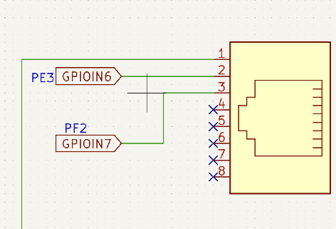
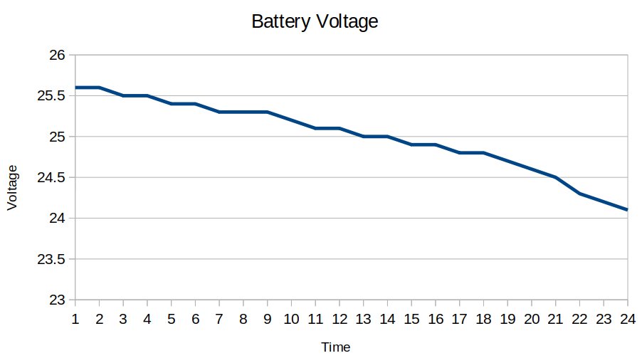

.. _electrical_control_system:

Electrical control system
###########################

PCB Design
***********

InwZaBoard

|

For lnwZaBoard we design it to manage the stage of the robot and hub of all device connection.This board will mount on base of the robot and connect to driving system board.There are 7 parts as follows

1. Power source for electrical control board

|

    - Power MOSFET (Q1)

        Before electrical power will connect into other components, electrical power from source (J1) must be through the  power MOSFET (Q1) which is controlled by SWboard (J2) at the panel. SWboard will send voltage signals directly from the battery which signal voltage between 20-30V. So this signal need to use voltage divider (R1 and R2) to make signal to 5 V at the gate pin of the MOSFET 

        Lets R1 fixed to 10 k𝛺 , set Vin to 30 V. and  Vout change to 5 V. 

        .. math:: 

            R_{2} = \frac{V_{out} x R_{1}}{V_{in} - V_{out}} = \frac{5 x 10000}{30 - 5} = 2000 \Omega \\
        
        If we set R2 to 2k𝛺 , Vout when Vin is 20 V. is 

        .. math:: 

            V_{out} = \frac{V_{in} x R_{2}}{R_{1} + R_{2}} = \frac{20 x 2000}{10000 + 2000} = 3.3 V

        So when we use R1 at 10 k𝛺 and R2 at 2k𝛺 ,  Vout will divided to 3.3 - 5 V. for gate threshold voltage

|

    - Protection fuse (F1)

        After electrical power pass through the MOSFET(Q1) . circuit muse be protection system in order to protect over current and short circuit. So we use 10A 250V fuse to protect in this section.

2. Buck converter circuit (LM2576HV)

|

    - Component selection 

        From datasheet , it suggested that 

        - C1 must be 100 uF , 75 V. Aluminum Electrolytic
        - C2 must be 1000uF, 25 V. Aluminum Electrolytic 
        - D1 must be Schottky diode (MBR360)
        - L1 must be 100uH 4.4A (7916N-101M)

        From this circuit , we will get a buck converter circuit that supply constant voltage at 5 V. and maximum current at 3A  

|

3. Charge pump circuit (TJ7660N)

    In order to Op-amp need a negative voltage to function. So we choose to implement a charge pump circuit using the TJ7660N charge pump voltage converter IC that is used for converting positive constant voltage to negative constant voltage.

|

    - Component selection 

        From datasheet , it suggested that
        
        - C4 must be 10 uF , polarized capacitor
        - C5 must be 10 uF , polarized capacitor 

        C6 is 4.7 uF polarized capacitor as a bypass capacitor in this circuit 

        From this circuit , we will get a charge pump circuit that supply constant voltage at  - 5 V. for connecting with Vss of Op-amp

|

4. Lidar sensor and Coil contact Hub

|

    This part contains 2 mosfets that control contactor coil and supply electricity to Lidar.This contactor coil will supply the electricity in part of Body and Base of robot. 

5. Op-amp circuit

|

    This part is design to amplify voltage signals from resistor chants that give 0-0.75mV to 0-3.3V for the amp meter to enable measuring current.

6. RJ45 port 

|

    This part is the RJ45 port for connecting 2 user buttons,Emergency button and Start button.We use RJ45 for easy connection and maintenance.

7. Control Panel port 

|

    This part contains 4 mosfets that control the pilot lamp for display state of the robot,GPIO pin port for switch mode of operation and GPIO pin port for Power transmission of the base device.

8. External Panel

|

    There are 4 functions at the panel of the robot.

       - Current sensors : it is used for measuring the current of the entire robot. 
    
       - Selector switch : It is used to turn the robot on and off 
    
       - Indicator lamp :  It is used to show electrical status of the robot
    
       - On - off switch : It is used to turn the electrical control system on and off

    - Selector switch and Indicator lamp

|

        - Selector switch A : A is the selector switch that controls the contactor at the body of the robot which will have a green indicator lamp shown at the panel.    

        - Selector switch B : B is the selector switch that controls the contactor at the base of the robot which will have a blue indicator lamp shown at the panel. 