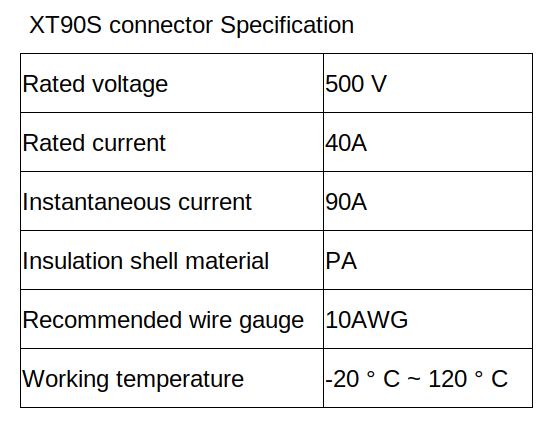
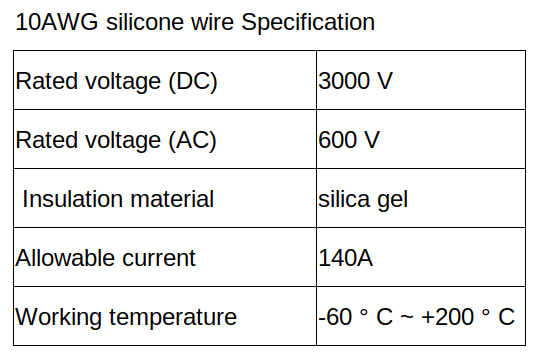
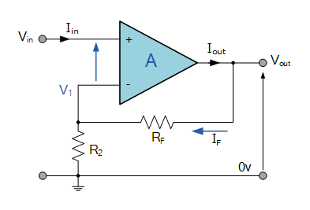

.. _electrical_sensors:

Electrical Sensors
##########################

Current sensors
****************

Due to high current at the battery. To make current sensors by sensor we must measure current at 0A current to 100A current. So we use shunt resistor (750 𝜇𝛺) to measure voltage drop in resistor. By voltage value can be calculated from Ohm’s law 

.. math:: V_{max} = I_{max}R =100 \times 750 \times 10^{-6} = 0.075 V = 75 mV. 

When we get a sensor value the voltage is between 0 - 75 mV which is a very small range. If we want to input this value into the ADC of the microcontroller, we need to gain this voltage by op-amp in non-inverting amplifier mode. (gain voltage to 0- 3.3V for STM32h745 ADC)

|

.. math:: 

    A_{V} = \frac{V_{out}}{V_{in}} = \frac{3.3}{0.075} = 44 \\
    A_{V} = 1 + \frac{R_{F}}{R_{2}} \\
    43 = \frac{R_{F}}{R_{2}} \\
    R_{F} = 43(R_{2})

Therefore , if we set R2 to 1 k𝛺  RF will be 43 k𝛺 . in this robot, we use variable resistor to set and calibrate resistor in this section (by selecting R2 at 1 k𝛺  and RF is variable resistor 100 k𝛺)

Although we have a digital current sensor with an ADC of microcontroller, we still need an analog sensor which is installed and displayed at the robot panel (pointer needle ammeter). It is used to view sensor value in real time and prevent errors at the microcontroller.

Voltage sensors
*****************

When we want to check the voltage of the battery to calculate the state of charge (remaining battery capacity). First, we have to know the present voltage of the battery. But the battery voltage is up to 29V. So we reduce the voltage to 3.3V for the ADC of the microcontroller. In this case we use a voltage divider to set voltage as we want and set current limit by the resistor that we choose.

- Voltage divider : lets battery voltage between 20-30 V , lets maximum voltage of voltage divider circuit is 3.3V and lets first resistor (R1) is 10 k𝛺 .So second resistor will be calculated by.

.. math:: 

    R_{2} = \frac{V_{out} \times R_{1}}{V_{in}-V_{out}} = \frac{3.3 \times 10000}{30 - 3.3} = 1235.955 \Omega

And Vmin is calculated by : 

.. math:: 

    V_{min} = \frac{V_{in} \times R_{2}}{R_{1}-R_{2}} = \frac{20 \times 1235.955}{10000 + 1235.955} = 2.2V

|

If the battery voltage is 20-30 V. when voltage passes this circuit. It will decreased to 2.2 - 3.3V

    - Signal conditioning : from output voltage is 2.2 - 3.3 V it mst be change to 0 - 3.3V for best resolution of microcontroller ADC. then we need to offset voltage by 2.2, making voltage is 0 - 1.1 V then amplify to 0 - 3.3 V  Lets V1 = input voltage , V2 = reference voltage (2.2 V) , Vout = output voltage

.. math:: 

    V_{out} = \frac{R_{3}}{R_{1}} \times (V_{2} - V_{1}) \\ 
    \frac{R_{3}}{R_{1}} = \frac{V_{out}}{V_{2} - V_{1}} = \frac{3.3}{2.2 - 1.1} = 3 \\
    R_{3} = 3(R_{1}) \\
    R_{1} = R_{2} \\
    R_{3} = R_{4}

|

Therefore , if we set R1 to 1 k𝛺  RF will be 3 k𝛺 . in this robot, we use variable resistor to set and calibrate resistor in this section (by selecting R1,R2 at 1 k𝛺  and R3,R4 is variable resistor 10 k𝛺)