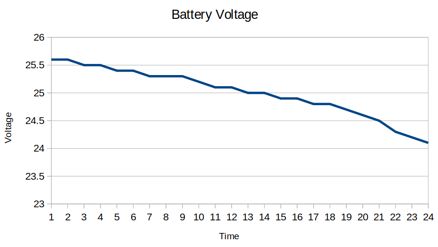
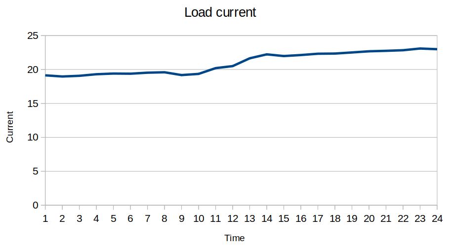
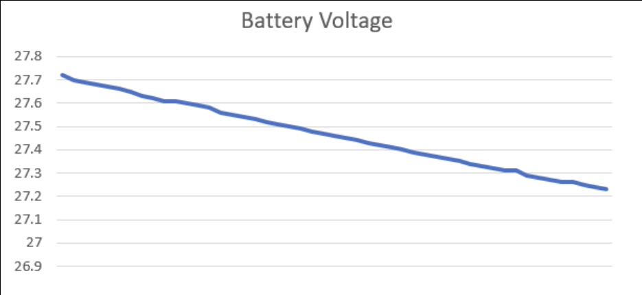
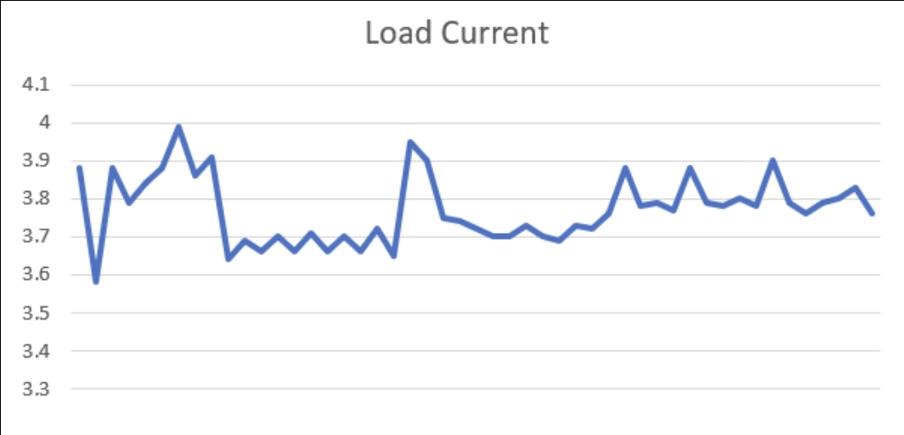
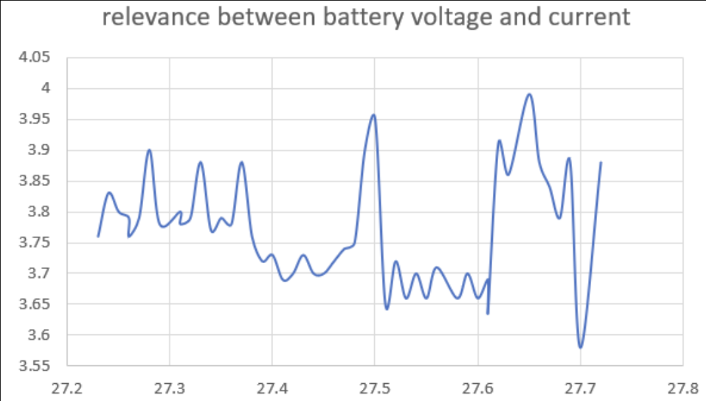

.. _experiment:

Experiment
###########################

Electrical Load Testing (Full load)
************************************

From calculation, we know total load when robots operate at full load. So we designed this experiment to test actual load when robots operate in typical applications.

**Experimental design**

- robot operating time = 4 hrs. 
- robot inertial remaining battery = 25.6 V
- robot calculated average current = 30A (remove UR3e and motor from load calculation)

**Desired result from experiment**

- Real robot rated current
- The relevance between battery voltage and robot operating time. 

**Result**

|

    - In case of battery voltage, the robot operates at full load mode. In 4 hours, battery decrease about 1.5 V. by voltage characteristics of this graph according to NMC characteristics graph which becomes linear when a single battery cell has voltage between 3.75 - 3.55 V. (with multiple cell will be at 26.25 - 24.85 V) 

|

    - In the case of robots, they operate in full load mode. Robots will set current to constant at 19 A. but in watt’s law, when devices supply a constant power. When voltage decrease depend on battery ,  current will be increase instead.

Electrical Load Testing (Standby load)
***************************************

From calculation, we know total load when robot operate at standby load. So we designed this experiment to test actual load when robot operate in typical application.

**Experimental Design**

- robot operating time = 4 hrs. 
- robot inertial remaining battery = 27.72 V
- Robot calculated average current = 2.5A (remove UR3e from load calculation)

**Desired result from experimen**

- Real robot rated current 
- The relevance between battery voltage and robot operating time. 

**Result**

|

- In case of battery voltage, the robot operates at standby mode. In 4 hours, battery decrease about 0.51 V. by voltage characteristics of this graph according to NMC characteristics graph which become linear when single battery cell has voltage between 4.15 - 3.75 V. (with multiple cell will be at 29.2 - 26.25 V) 

|

- In the case of robots, they operate in standby mode. Robots will drain current between 3.6 - 4 A. because some devices drain current unsteady such as Intel NUC. So the average current in this experiment is 3.77 A. 

|

- When we compare between battery voltage and load current, it is considered that current will be increased when battery voltage decreases. Because devices drain load at constant power.   

**Linear Load calculation**

- Calculated current load = 2.5A.
- Initial voltage = 27.72 V.
- Operating time = 4 hours.

.. math:: 

    Power consumptions(P_{cons}) &= Current per hour \times Voltage = 2.5 \times 27.72 = 69.3 Wh \\

    Operating time = 4 hours: power &= P_{cons} \times Opt.time = 69.3 \times 4 = 277.2 W \\

    battery power capacity (P_{init}) &= Voltage \times capacity = 27.72 \times 220 = 6098.4 Wh \\

    When using battery: remaining power &= P_{init} - P_{cons} = 6098.4 - 277.2 = 581.2 Wh \\
    
    Final voltage &= \frac{remaining power}{capacity} = \frac{5821.2}{220} = 26.46 V \\

Charging Load Testing
**********************

From calculation, if we charge the robot when the robot's remaining battery is about 10-20% , the charger will precharge at a small current. Then the charger will charge at constant (40A) when battery resistance is a value that can be charged. Finally when the battery capacity is almost full (80-100%) the charger will charge at constant voltage (29.2V). So we designed this experiment to test actual current when the robot is charging in each period.

**Experimental design**

- robot remaining battery voltage : xx.x V
- Max charger current :  40A 

**Desired result from experiment**

- Real Charging time.
- Charger behavior in each period.
- Real charger current during charge.

**Result**