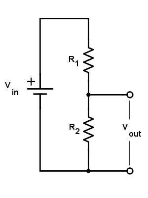
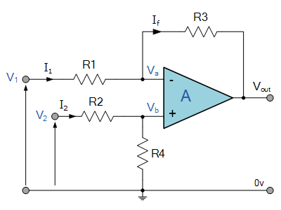
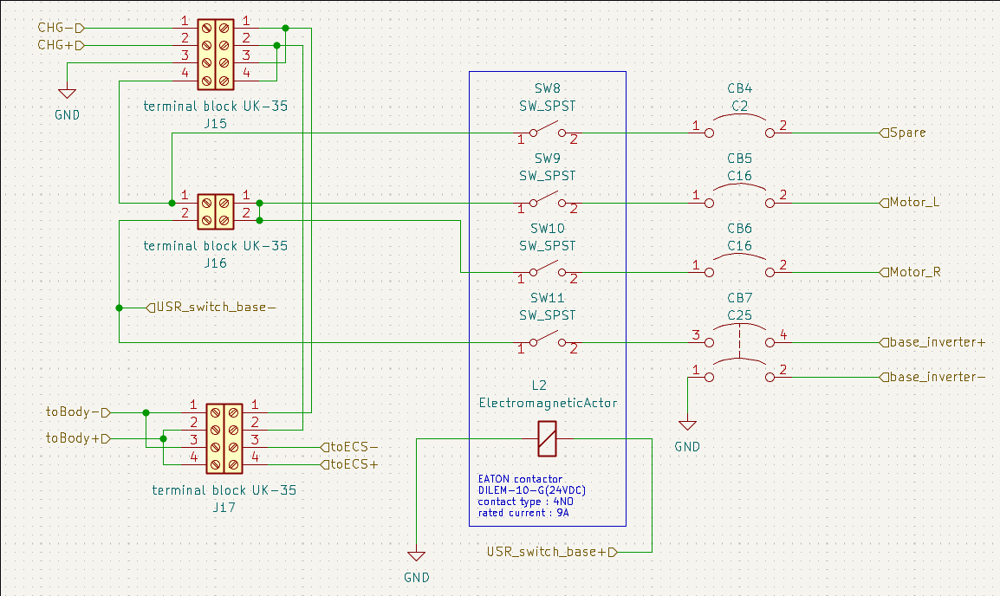
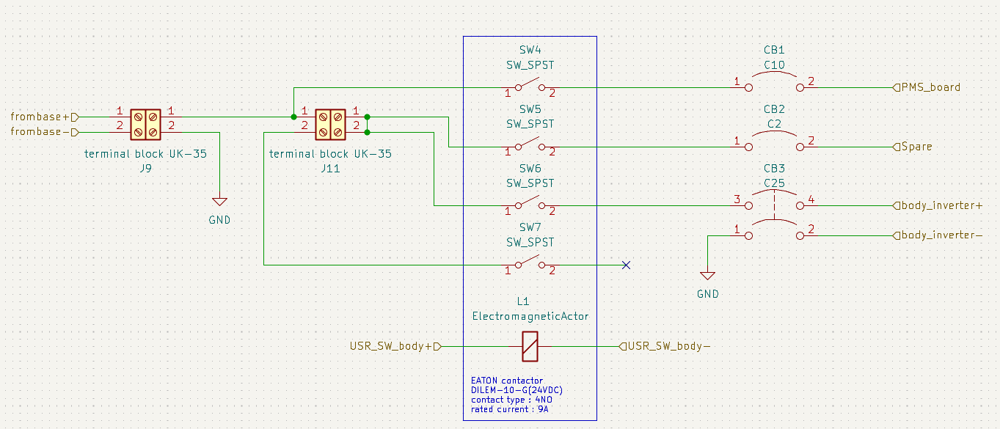

.. _power_management_system:

Power management system
##########################

Base section
*************

|

The battery supplies voltage 24 VDC to the terminal at the base section then forward to the body of the robot and electrical control system, both of these require 24 VDC. The base section is used to control loads for example inverter, motor and spare systems. However, before supplying voltage to any load we must have a controller and protection for loads. The contractor allows voltage to all loads that are controlled by a microcontroller and uses a circuit breaker to protect each load.  

- Circuit breaker selection

    - motor

|

    From the table,  the motor output power is 350 W and we supply voltage 24 VDC. Therefore, we can calculate the current of the motor.

    .. math:: 

        P = VI \\
        I = \frac{P}{V} = \frac{350}{24} = 14.58 Amp

    At the max power 350 W we calculated current at 15 Amps. As a result, we select a circuit breaker CB16 that can resist current 15 Amps when the circuit is short.

    - Inverter
    - Spare

Body section
*************

|

From the base section give voltage 24 VDC to the body section. This section will supply voltage to the power control board that means microcontroller to control the contractor at the base section. In addition, this part will supply voltage to the inverter and spare system.However, we must have a controller and protector on this part like the base section, there are contractors and circuit breakers.

- Circuit breaker selection

    - Power management system board
    - Inverter

.. image:: ./images/17.png
    :width: 480
    :align: center

|

        The inverter for convert 24 VDC to 220 VAC then supply to jetson nano and intel nuc because both devices require 220 VAC to work

    - Jetson nano require 5-10 W

|

    - Intel nuc require 500 W

        We need power after converting to VAC around 510 from jetson nano max 10 W intel nuc 500 W but the worst case converter has efficiency 92% then we can calculate power before convert below.

        .. math:: 

            P_{out} = 510 W \\
            P_{in} = P_{out} \times \frac{100}{eff.} = 510 \times \frac{100}{92} = 544.35 W \\
            I = \frac{P}{V} = \frac{544.35}{24} = 22.68 A

    - Spare
