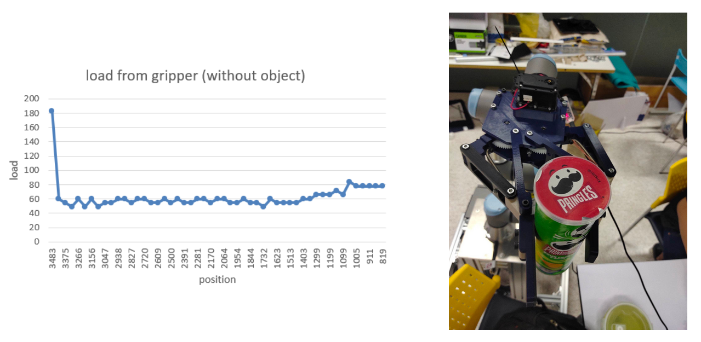
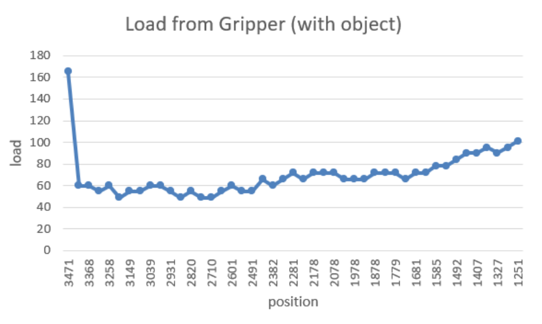
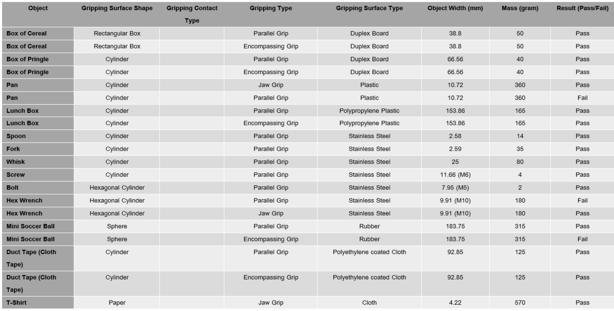
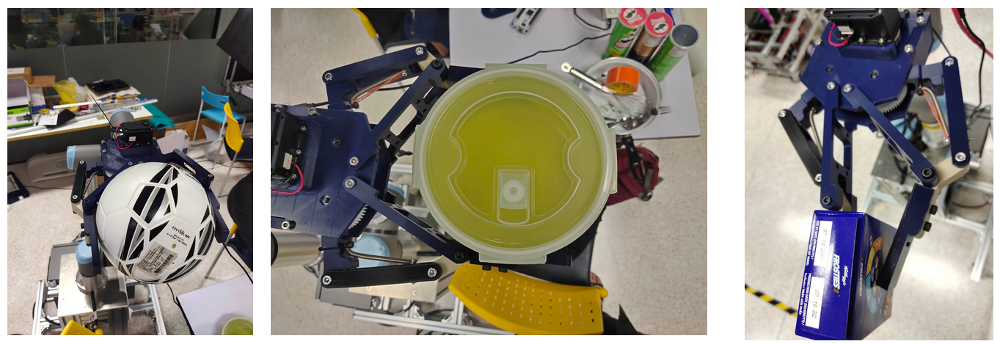

=======
Gripper
=======

Finding a appropriate force for control gripper
-----------------------------------------------

Dynamixel has a present load function for reading the currently applied load. To find an appropriate force for a gripper to pick up an object, 
a pringles’s box is used in the experiment. The moving speed of the dynamixel is 12 rpm/min and its moving position is in range 800 - 3600. 
When the gripper close without grab any object, present load is show below

| From a graph, at the starting point it has load at 180 and goes down to 60.when gripper is close, a load value is increase to 84
| According to this information, the first load value for this experiment is 80. Increments by 5

.. csv-table::
    :header: Load,Result(pass/fail)

    80,fail
    85,fail
    90,fail
    95,fail
    100,pass

According to the result, an appropriate load for control gripper is 100 (10% of maximum torque)

Testing an appropriate force with other object
----------------------------------------------

According to experiment 1, an appropriate load is 100. In this experiment a mini soccer ball, lunch box, cereal box, fork, screw, bolt, hex 
wrench, duct tape, whisk and T-shirt are used.

According to the result, A gripper can grip different objects by different pose 17 pose from 20 pose. But a gripper still has some problems 
with a mechanical part.

