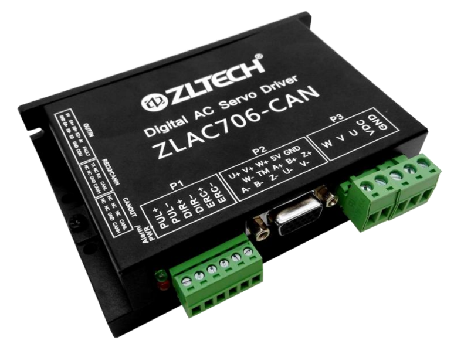

====================
Hub Motor and Driver
====================
Firmware-Team is using ZLTECH's hub motor and driver provided by Aj.Pi for both wheels.

.. csv-table::
    :header: Type,Product Name

    Hub Motor,ZLLG65ASM250-4096 V2.0
    Driver,ZLAC706-CAN

ZLLG65ASM250-4096 V2.0
----------------------

.. image:: ./images/hubmotor.jpg
    :height: 400
    :width: 400
    :align: center

`ZLLG65ASM250-4096 V2.0 <http://zlrobotmotor.com/info/383.html>`_ is a ZLTECH's servo hub motor with an built-in encoder 
specially designed for mobile robot application and also powered by 24-48 VDC. Here is some specification of this hub motor

.. image:: ./images/hubmotor_spec.jpg
    :height: 497
    :width: 375
    :align: center

**Basic Features:**

- Hub Servo Motor for Robot, AGV
- 24-48VDC, 350 W
- Rated speed: 200 rpm
- Rated torque: 8 Nm
- Max capacity: 150 kg/2 motors
- Brake: Electric brake

ZLAC706-CAN
-----------

`ZLAC706-CAN <https://drive.google.com/file/d/1_zax1QebzwfDw8Wtzx-VV3qV7C4o2Byv/view>`_ is a ZLTECH's servo driver with CAN communication protocol

**Basic Features:**

- Low Voltage Servo Driver
- 24-60VDC for 400 W motor
- Output current: average 8A, peak 24A
- Output speed: up to 1000 rpm
- Communication: CAN, RS232
- Software parameter setting (RS232)