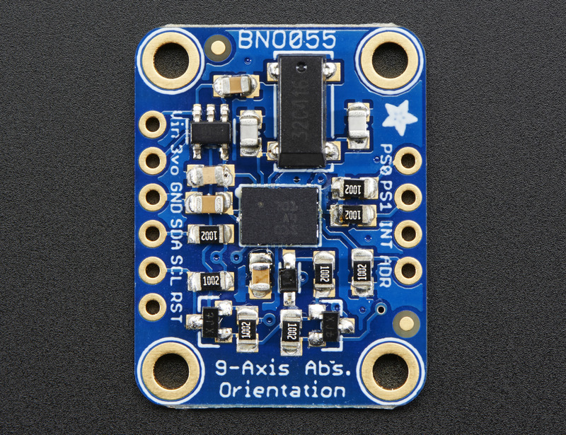

==========
IMU Sensor
==========

In the process of mobile robot localization, we need current inertial measurement of robot like linear acceleration,
angular velocty and orientation. The sensor that we're using is BNO055 Absolute Orientation Sensor.

BNO055
------

This is 9-DOF sensor including an accelerometer, gyroscope and magnetometer that has its own processor to perform
sensor fusion algorithms. They blends accelerometer, magnetometer and gyroscope data into stable three-axis orientation 
output. 

The BNO055 can output the following sensor data:

* **Absolute Orientation** (Euler Vector, 100Hz)

  + Three axis orientation data based on a 360° sphere

* **Absolute Orientation** (Quaterion, 100Hz)

  + Four point quaternion output for more accurate data manipulation

* **Angular Velocity Vector** (100Hz)

  + Three axis of 'rotation speed' in rad/s

* **Acceleration Vector** (100Hz)

  + Three axis of acceleration (gravity + linear motion) in m/s^2

* **Magnetic Field Strength Vector** (20Hz)

  + Three axis of magnetic field sensing in micro Tesla (uT)

* **Linear Acceleration Vector** (100Hz)

  + Three axis of linear acceleration data (acceleration minus gravity) in m/s^2

* **Gravity Vector** (100Hz)

  + Three axis of gravitational acceleration (minus any movement) in m/s^2

* **Temperature** (1Hz)

  + Ambient temperature in degrees celsius

| **References:**
| [1] https://learn.adafruit.com/adafruit-bno055-absolute-orientation-sensor/overview

