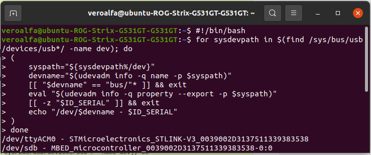

==========
ROS2 Setup
==========

In the :ref:`ROS2 Architecture <ros2Arc>` xicro-package and calibration-package is required to perform system integration between
microcontroller and ROS2. The aim is to output navigation related message to navigation node and bring command from that node to 
microcontroller for robot movement. The first thing to do is installing both packages and setup microcontroller in ROS2.

Calibration and Xicro Installation
----------------------------------

1. Install python library
~~~~~~~~~~~~~~~~~~~~~~~~~
We need to install Xicro's related library first in order to communicate with microcontroller via serial port.
In the terminal, type these commands to install python libraries.

.. code-block:: 

    pip3 uninstall serial
    pip3 install pyserial
    pip3 install numpy

2. Clone package from Github
~~~~~~~~~~~~~~~~~~~~~~~~~~~~
Go to `Firmware-Team's Github <https://github.com/MBSE-2022-1/Firmware-Team/tree/Xicro-ROS2>`_ then clone xicro-package and
calibration-package from Xicro-ROS2 branch to your ``workspace/src``

In the ``workspace/src`` directory, run the following command:

.. code-block:: 

    git clone https://github.com/MBSE-2022-1/Firmware-Team/tree/Xicro-ROS2

3. Give permission to all python scripts in both packages
~~~~~~~~~~~~~~~~~~~~~~~~~~~~~~~~~~~~~~~~~~~~~~~~~~~~~~~~~
In the ``workspace/src/Firmware-Team-Xicro-ROS2/Xicro/xicro_pkg/scripts`` and ``workspace/src/Firmware-Team-Xicro-ROS2/calibration/calibration/scripts``
, run the following command:

.. code-block:: 

    chmod 777 *

4. Build the workspace with colcon
~~~~~~~~~~~~~~~~~~~~~~~~~~~~~~~~~~
In the ``workspace/src`` directory, you can now build both packages using the command:

.. code-block::

    colcon build

.. note:: 
    After build packages, you can now source your files with ``source ~/workspace/install/setup.bash`` command or write this
    command in your ``.bashrc``. So every time you open terminal system will automatically source files for you.

5. Start using xicro and calibration scripts
~~~~~~~~~~~~~~~~~~~~~~~~~~~~~~~~~~~~~~~~~~~~
You can now use python scripts in both packages ``scripts`` directory to open related nodes.

.. code-block::

    ros2 run xicro_pkg xxx.py
    ros2 run calibration xxx.py

Hardware Setup
--------------

1. Find microcontroller device dev path
~~~~~~~~~~~~~~~~~~~~~~~~~~~~~~~~~~~~~~~
After connect your microcontroller to ROS2 via usb port, run the following command to find device dev path of microcontroller:

.. code-block::

    #!/bin/bash

.. code-block:: 

    for sysdevpath in $(find /sys/bus/usb/devices/usb*/ -name dev); do
    (
        syspath="${sysdevpath%/dev}"
        devname="$(udevadm info -q name -p $syspath)"
        [[ "$devname" == "bus/"* ]] && exit
        eval "$(udevadm info -q property --export -p $syspath)"
        [[ -z "$ID_SERIAL" ]] && exit
        echo "/dev/$devname - $ID_SERIAL"
    )
    done

You can now see that microcontroller stlink's path is ``/dev/ttyACM0``.

.. _mcuport:

2. Open microcontroller usb port
~~~~~~~~~~~~~~~~~~~~~~~~~~~~~~~~
**Every time when connecting microcontroller to ROS2, you need to run this command to open usb port**. Otherwise xicro node can not
connect to your microcontroller.

.. code-block:: 

    sudo chown $USERNAME /dev/ttyACM0

  