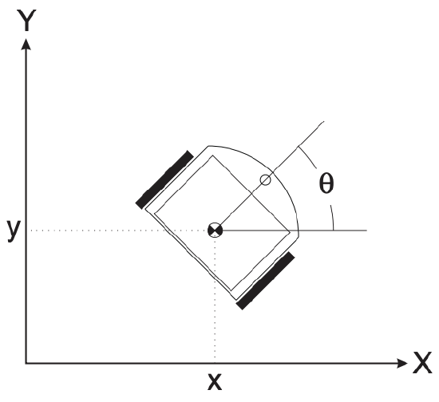
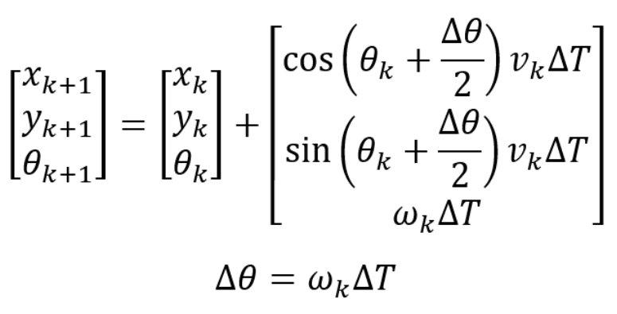
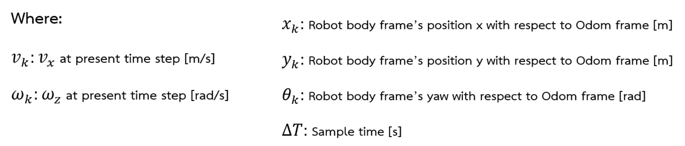

==========================
Wheel Odometry Computation
==========================

Odometry Update
---------------

Implemention (Core M7)
----------------------

.. code-block:: c++

    void WheelOdometry(float linear_velocity, float angular_velocity, float time_step)
    {
        float temp_tetra = Robot_Yaw + (angular_velocity*time_step*0.5);
        Robot_X = Robot_X + cos(temp_tetra)*linear_velocity*time_step;
        Robot_Y = Robot_Y + sin(temp_tetra)*linear_velocity*time_step;
        Robot_Yaw = Robot_Yaw + angular_velocity*time_step;
    }

Runtime Test
------------

.. code-block:: c++

    runstarttime = micros();
    //**************************************************
    WheelOdometry(Robot_LinVel, Robot_AngVel, timestep);
    //**************************************************
    runtime = micros() - runstarttime;

Runtime: 0.006 ms