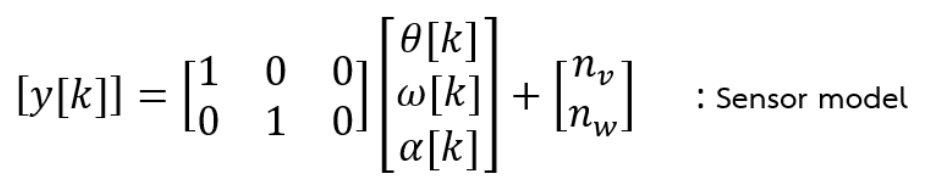

=========================
Wheel Velocity Estimation
=========================

Kalman Filter Algorithms
------------------------

Kinematics Base Model
----------------------
Assumption: Zero mean gaussian jerk

.. image:: ./images/kalman_states.png
    :height: 195
    :width: 434
    :align: center
.. image:: ./images/kalman_process.png
    :align: center

.. image:: ./images/kalman_C.png
    :height: 67
    :width: 382
    :align: center

Matrix Summary
--------------

.. image:: ./images/kalman_summary.png
    :height: 461
    :width: 521
    :align: center

Kalman Output
-------------

.. image:: ./images/kalman_output.png
    :height: 444
    :width: 588
    :align: center

Implemention (Core M7)
----------------------

.. code-block:: c++

    void Predict_RightWheel()
    {
        X_R = A*X_R + B*U;
        P_R = A*P_R*(A.transpose()) + G*Q_R*(G.transpose());
    }
    float UserCodeUpdateRightWheel(float position, float velocity)
    {
        Predict_RightWheel();
        Y_R(0,0) = position;	// assign value of encoder
        Y_R(1,0) = velocity;	// assign value of encoder
        K_R = P_R*(C.transpose()) * (C*P_R*(C.transpose()) + R_R).inverse();
        X_R = X_R + K_R*(Y_R - C*X_R);	// get new X(estimated state)
        P_R = (MatrixXf::Identity(3,3) - K_R*C) * P_R;
        return X_R(1,0);	// get estimated velocity
    }

.. code-block:: c++

    void Predict_LeftWheel()
    {
        X_L = A*X_L + B*U;
        P_L = A*P_L*(A.transpose()) + G*Q_L*(G.transpose());
    }
    float UserCodeUpdateLeftWheel(float position, float velocity)
    {
        Predict_LeftWheel();
        Y_L(0,0) = position;	// assign value of encoder
        Y_L(1,0) = velocity;	// assign value of encoder
        K_L = P_L*(C.transpose()) * (C*P_L*(C.transpose()) + R_L).inverse();
        X_L = X_L + K_L*(Y_L - C*X_L);	// get new X(estimated state)
        P_L = (MatrixXf::Identity(3,3) - K_L*C) * P_L;
        return X_L(1,0);	// get estimated velocity
    }

Runtime Test
------------

.. code-block:: c++

    runstarttime = micros();
    //******************************************************************************************************
    Pulse2Position();
    estimated_rightvel = update_rightwheel(Right_DegRel, Right_DegSec)*(M_PI/180)*0.085;	// DegSec to m/s
    estimated_leftvel = update_leftwheel(Left_DegRel, Left_DegSec)*(M_PI/180)*0.085;		// DegSec to m/s
    //******************************************************************************************************
    runtime = micros() - runstarttime;

Runtime: 0.059 ms