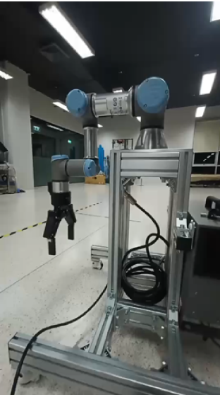
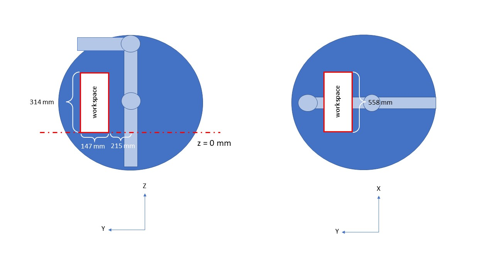

.. _manipulation:

Manipulation
#################

.. raw:: html

    <h1 align="center">
      

        

          <iframe width="560" height="315" src="https://www.youtube.com/embed/0JdI6uxSKN8" title="YouTube video player" frameborder="0" allow="accelerometer; autoplay; clipboard-write; encrypted-media; gyroscope; picture-in-picture" allowfullscreen></iframe>
        

      

    </h1>

Overview
**********

The manipulation node is used to control the UR3e robotics arm to carry the luggage by moving to pose that the Object detection node has sent and putting the luggage down when the CACAO robot reaches to destination. In the video, we are showing how UR3e robot moves to goal pose and grabs the luggage.

 .. figure:: ./docs/images/Manipulator_Architecture.jpg
     :width: 480
     :align: center
     :alt: Manipulator Architecture
     
     Figure 1: Manipulator Architecture

Manipulation Concepts
""""""""""""""""""""""

In the Manipulator node, we have two ability behavior.

1. Grab Object: is ability behavior for grab object of manipulator

   Workflow of Grab Object behavior

   - Receive pose

      Receive goal position in XYZ axis from Object Detection node. In this version of the manipulation node, we fixed the orientation of UR3e for grabbing the luggage only. 

      The frame of camera and UR3e is:

      .. figure:: ./docs/images/The_frame_of_camera_and_UR3e.jpg
          :width: 480
          :align: center
          :alt: The frame of camera and UR3e

          Figure 2: The frame of camera and UR3e

   - Enable service

      Waiting for Software Integration call service /enable_mani_grab to start grab object ability behavior.

   - Check limit workspace

      Checking position from Object Detection is over the workspace of UR3e and check position is damaged to the CACAO robot. Suppose the position from Object Detection is over workspace or can collide CACAO robot. In that case, Manipulator node will call function ‘Pose to Navigation’ for requiring Navigation node to navigate CACAO robot to position that manipulator can garb object in workspace. 

   - Set TCP pose

      Set the end effector offset and end effector frame of UR3e using the function from ur_rtde. 

   - Move to goal pose

      If manipulation can control in workspace, the node will send scripts to control the UR3e pose using ur_rtde. In this version, we use only moveJ (joint space path) to control UR3e for avoiding singularity and make UR3e have more workspace for move.

   - Pose to Navigation

      If position is over workspace, the node will calculate position and send it to Navigation node for required Navigation node to navigate the robot to position that manipulator can grab an object in workspace.

   - Gripper Control

      Control gripper using UR-scripts. After gripper grab, object manipulation will move while holding the object to home pose and send ‘success’ status to System Integration.

2. Release Object: is ability behavior for release object of manipulator

   Workflow of Release Object behavior

   - Enable Service
   - Move to goal pose
   - Gripper Control

Installation
*************

1. Set up UR3e

   - Change mode in UR teach pendant to remote control. 

      .. figure:: ./docs/images/changeMode.jpg
          :width: 480
          :align: center
          :alt: Changing mode in UR teach pendant to remote control

          Figure 3: Changing mode in UR teach pendant to remote control

2. Set up IP address

   - Set up on UR3e

      .. figure:: ./docs/images/setIPonUR.png
          :width: 480
          :align: center
          :alt: Set up IP address on UR teach pendent

          Figure 4: Set up IP address on UR teach pendent

   - Set up your computer

      .. figure:: ./docs/images/setIPonCom.png
          :width: 480
          :align: center
          :alt: Set up IP address on computer

          Figure 5: Set up IP address on computer

3. install ur_rtde 

   Ur_rtde is a C++ interface for controlling and receiving data from an UR robot using the Real-Time Data Exchange (RTDE). (More information here https://sdurobotics.gitlab.io/ur_rtde/)

   .. code-block:: bash

      sudo add-apt-repository ppa:sdurobotics/ur-rtde
      sudo apt-get update
      sudo apt install librtde librtde-dev

4. Install pyblind11

   - install Boost on Ubuntu using

   .. code-block:: bash

      sudo apt-get install libboost-all-dev

   - Build ur-rtde to use with Python

   .. code-block:: bash

      git clone https://gitlab.com/sdurobotics/ur_rtde.git
      cd ur_rtde
      git submodule update --init --recursive
      mkdir build
      cd build
      cmake ..
      make
      sudo make install

5. Verify ur_rtde package

   There is a simple example using the RTDE Control Interface to move the robot to a pose with the moveJ command.

   .. code-block:: python

      import rtde_control
      rtde_c = rtde_control.RTDEControlInterface("192.168.20.35")
      rtde_c.moveJ([4.71, -1.57, 1.57, -1.57, -1.57, 0], 0.5, 0.3)

6. Install socket

   Socket is the package for creating the connection between the computer and the Universal robot. We will use socket packet to send UR-scripts for control 2F-140 Gripper.

   .. code-block:: python
      
      pip install sockets

Example
*********

- Clone Manipulation package from Github

   .. code-block:: bash

      git clone https://github.com/MBSE-2022-1/Software-Team.git -b Manipulation

- Build Manipulation package

   .. code-block:: bash
      
      cd your_workspace
      colcon build --symlink-install

- Run Manipulator Node

   - Connect LAN between UR3e controller box and your computer

   - Change mode in UR teach pendent to remote control. 

   - Run Manipulator Node

API Reference
***************

.. rst:directive:: activated_gripper()

   Used for activated 2F-140 Gripper on UR3e.

.. rst:directive:: close_gripper(int: force, int: speed, range)

   Used for close 2F-140 Gripper on UR3e.

   :parameters:
   
      force: Sets the force for gripper close commands, range [0-255]
      
      speed: Sets the speed for gripper close commands, range [0-255]

		range: Sets the range for closing gripper, range [0,255]

.. rst:directive:: open_gripper()

   Used for open 2F-140 Gripper on UR3e.

.. rst:directive:: mani_grab_enable_callback(request, response)

   Callback function when service /mani_grab_enable has been called.

.. rst:directive:: mani_release_enable_callback(request, response)

   Callback function when service /mani_release_enable has been called.

.. rst:directive:: reciceve_pose_callback(msg: Point32)

   Callback function of when topic /position_rs2 has called.

.. rst:directive:: move_to_goal_pose()

   Used for sending command to move UR3e using pose from reciceve_pose_callback().

.. rst:directive:: check_workspace(x,y,z)

   Used for checking pose from reciceve_pose_callback() is over workspace or not. 

   :parameters:
   
      x: Position in X axis [m]

      y: Position in Y axis [m]	
      
      z: Position in Z axis [m]

   :return:

      True:  Input pose is in workspace
      
      False: Input pose is over workspace

.. rst:directive:: PosToNav(x,y)

   Used to calculate position send to Navigation node for require Navigation node navigate the robot to position that manipulator can grab an object in workspace.

   :parameters:
   
      x: Position in X axis [m]

      y: Position in Y axis [m]	
   
.. rst:directive:: gripper_control(bool)

   Control gripper using UR-scripts. After the gripper grab, object manipulation will move while holding the object to home pose and send ‘success’ status to Software Integration.

   :parameters:
   
      True: Close gripper for grab object
      
      False: Open gripper for release object

Subsystem Verification
************************

1. Limit Workspace for moveL

   Try to limit workspace to avoid singularity of UR3e. We will set UR3e start pose in case of  receiving pose in the z-axis is more than 0 meters and less than 0 meters.

   - Started to pose in case z-axis is more than 0 meters

   Figure 6: Started to pose in case z-axis is more than 0 meters

|

   - Start to pose in case z-axis is less than 0 meters

   Figure 7: Started to pose in case z-axis is less than 0 meters

|

   So, we will find the position of UR3e that make UR3e doesn’t in singularity.

   - Workspace of case z-axis is more than 0 meters: https://youtube.com/shorts/sevNFUW1XMk?feature=share

   Figure 8: Workspace of case z-axis is more than 0 meters

|

   - Workspace of case z-axis is less than 0 meters: https://youtube.com/shorts/_4V6vwKqsns?feature=share

   Figure 9: Workspace of case z-axis is less than 0 meters

|

2. Emergency Stop Test

   Test emergency stop UR3e by program using StopJ of ur_rtde library.

.. raw:: html

    <h1 align="center">
      

        

          <iframe width="560" height="315" src="https://www.youtube.com/embed/0JdI6uxSKN8" title="YouTube video player" frameborder="0" allow="accelerometer; autoplay; clipboard-write; encrypted-media; gyroscope; picture-in-picture" allowfullscreen></iframe>
        

      

    </h1>

Problem and future plan
*************************

- Problem

   - Singularity when using moveL with UR3e. It will be better if we control manipulator in task space. 

   - Delay when changing between ur_rtde for control UR3e and socket for control 2F-140 gripper. It couldn’t send UR-Scripts with ur_rtde library now. 

- Future Plan

   - Add TCP orientation control of UR3e.

   - Make trajectory planning to avoid the obstacle.

   - Try to use package ROS2 Grasp Library (https://github.com/intel/ros2_grasp_library)