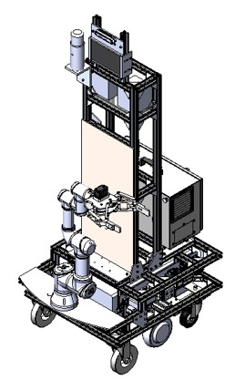
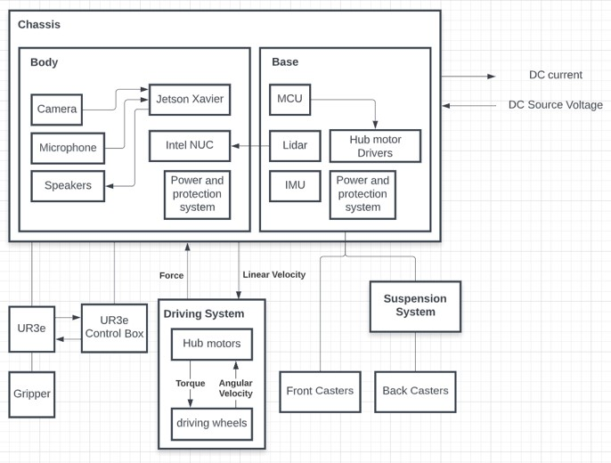
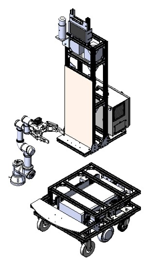

.. _mechanicaL_system:

Cacao's Mechanical System
#########################

Cacao's 3D model

System Design Overview
**********************
To Develop a "mobile manipulator prototype" for doing a proof of concept, requirements must be collected and form a mechanical system architecture. In RoboCup@home challenge, the robot must be able to see, walk, talk and manipulate objects in a dynamic environments.

This is ours architecture

This Mechanical System Architecture has a core at Chassis which seperates to 3 main parts, base body and gripper. Base is a mobile robot which can perform a SLAM and navigation by using Lidar, IMU and driving system that mounted on a base. Body is a structure for mount the others electronics components and Cacao's computational unit. In base and body, each part have independent power and protection system for debugging and isolate testing. The last part is UR3e Manipulator and Gripper which is a Cacao's arm and hand.

and from this architecture we seperate development process in to 3 parts

.. toctree::
   :maxdepth: 1

   mech_docs/Cacao_base.rst
   mech_docs/Cacao_body.rst
   mech_docs/Cacao_gripper.rst

