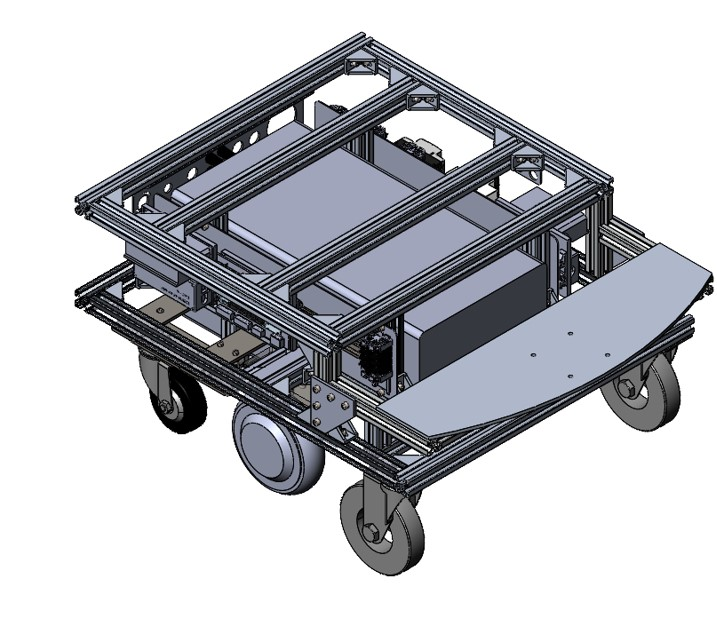
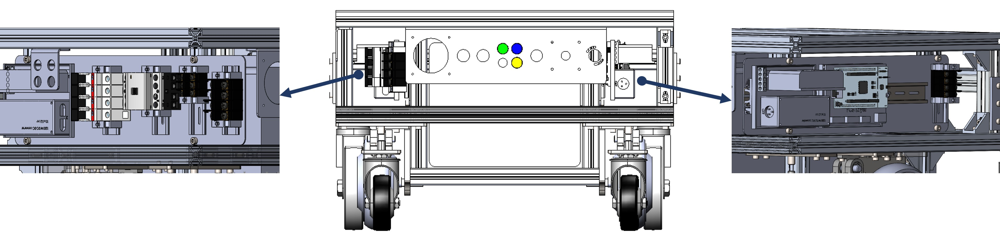
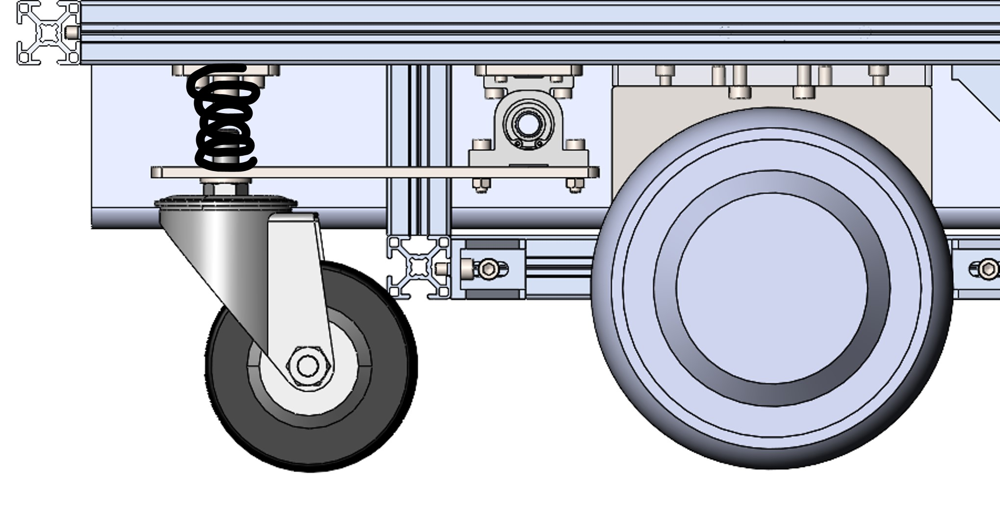
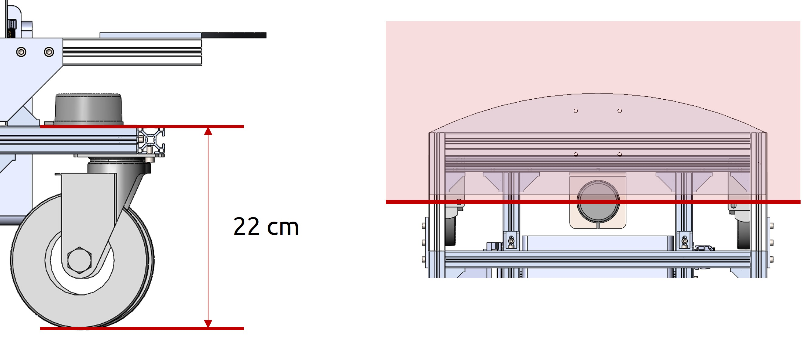

.. _Cacao_base:

Cacao's base
############

Cacao's base is a mobile robot which can perform SLAM and navigation isolate from Cacao's body.

Cacao's base components

- Driving system 
- Hub Motor
- Motor Driver
- Wheels
- Casters
- Front casters
- Back casters with suspension system
- MCU (Microcontroller Unit)
- Battery
- Power and Protection Circuit
- UR3e mounter
- Intel NUC (when isolate from Cacao's body)

Physical Details
****************
Base Dimension: 62.2 cm x 81 cm x 39 cm

Frabication Method: 

1. Using Aluminum Frame and Bracket
2. Laser cut metal Sheet and acrylic
3. Some custom parts using 3D printer

Design Methodology
******************
- Easy to maintain

Most of mobile robot conponents install on the face-out left and right plane using din rail as a installation method.

- Good traction

Simple bar and spring is choosen in this prototype for verify some expected use case. The main purpose for this suspension is increase the traction and support robot while movong through step ground.

- Ready for perform SLAM and mavigation

lidar, IMU and driving system are installed.

Verification
************
- Walk through 1 cm and 2 cm of ramps and step.

2 VDO here

- Walk through 1 inch length gap (elevator gap)

VDO here

On-going process
****************
- Change a spring for more reliable use. 

    Right now this spring able to increase traction and support ramp and step crossing, but it's too soft for maintain stability of a robot because there errors between calculation parameters and ideal parameters. To find the most suitable spring, we can fix by find upper and lower bound of a spring and form an spring testing experiment. 

- Next Design

    This Cacao's base design didn't cover about how to make a robot easy to relocate and some structures can be reduced.

- Tolerance 

    Misalignment always occur in assembling phrase, Cacao also. Acrylic positioner from high precision CNC laser cutter is the easiest way but not the best because it produce wastes. Moreover, metal fabrication tolerance must be concern. 