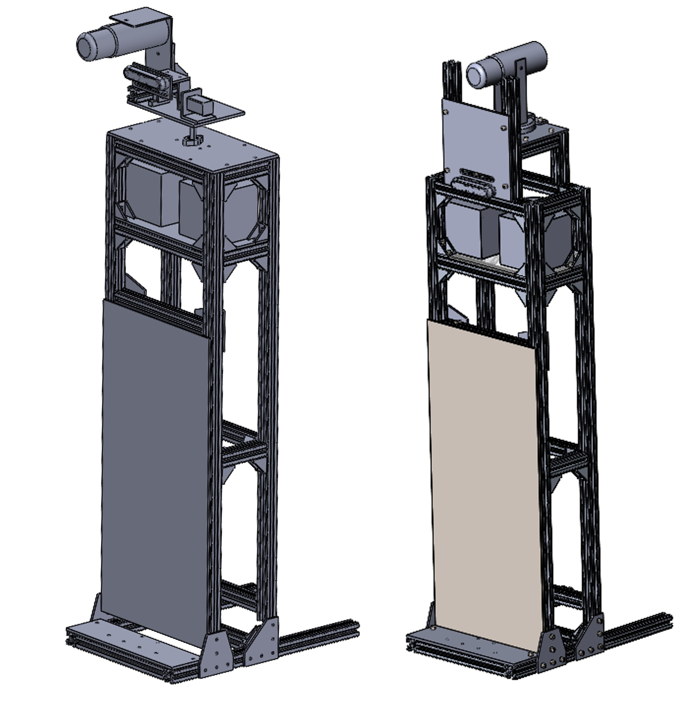

.. _Cacao_body:

Cacao's body
############

Cacao's body is the part that contains the most of robot's hardware.

Cacao's body components

- Intel NUC
- Jetson Xavier
- UR3e control box
- Speaker
- Microphone
- Power and protection system

Physical Details
****************

Body Dimension: xx cm x xx cm x 126 cm

Frabication Method: 

1. Using Aluminum Frame and Bracket
2. Laser cut metal Sheet and acrylic
3. Some custom parts using 3D printer

Design Methodology
******************

- Easy to install and maintain

Circuit area on Cacao's body is the main area for Software and Firmware hardware which using din rail for installation.

- Core of robot's perception

On body there are camera and microphone at the head which is a visual and sound perception. More than that there are a speakers for give a response to human.

On-going
********

- Adding a Z-axis actuator

Cacao's gripper need more workspace to operate some task. Mostly of industrial Z-axis actuator is a PLC based control which PLC is not installed in robot. Z-axis guide is 
considered as a harder way but able to use.

- Adding 2 DoF head

To do others task, Cacao need wider visual perception. At first, we have designed a 2 DoF head having yaw angle and pitch angle but didn't use yet.