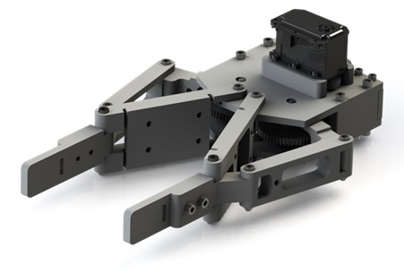
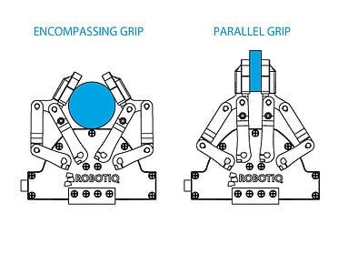
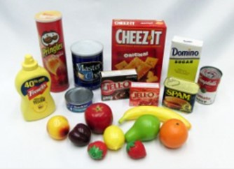
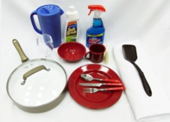
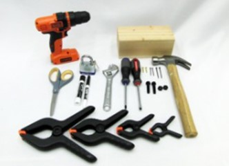
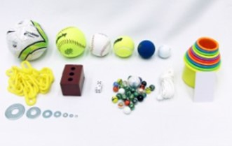
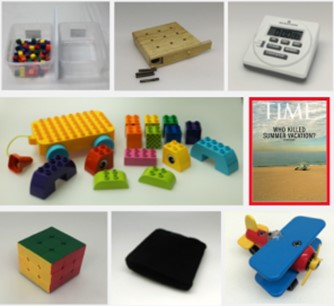

.. _Cacao_gripper:

Cacao's gripper
###############

During the competition, our team aimed to develop a gripper that can grip most, if not all, 
of the objects available in the competition. Our team opted for an encompassing gripper—a 
type of gripper that can adapt to the shape of an object which inspired by Robotiq gripper.

Started by collect sepicific requirements for design gripper.

Requirements
************

1. Physical Requirements
1.1. Gripper must be able to attach with UR3e end-effector mount.
1.2. Gripper must have weight lower than 1.3 kg when using with UR3e.
2. Functional Requirements
2.1. Robot must be able to manipulate objects.
2.1.1. Robot's manipulator must have payload enough for 1.5 kg object at end-effector (neglect gripper weight).
2.1.2. Gripper structure safety factor must be higher or equal 2.
2.2. Gripper should be able to grasp most of the standard objects in YCB dataset.
2.3. Gripper should not damage the grasping object.

Design Methodology
******************
- Light weight

    Use PLA and others plastic as the main material. 

Design Details
**************
- double 4 bar linkage mechnism

To change angular motion to linear motion and perform a parallel grip, 
Parallelogram linkage is selected to be the main concept. More than that, 
encompassing grip can perform by cooperation of 2 parallelogram linkage and 
torsional spring.

.. .. image:: ./image/kinematics_chain_Cacao_gripper.jpg
..     :width: 480
..     :align: center
..     :alt: Cacao's gripper Kinematics Chain

- Acuator

To drive the gripper's links, Dynamixel MX-64T is seleted as a motor which can generated 
driven torque around 6 Nm and combined with 25:54 gear ratio which can deliver 15.768 Nm 
of output torque. 

From the RoboCup@Home's rulebook, our team found out that maximum weight of object 
used in the competition is 1.5 kilograms which require 13.2 Nm torque (16.667 N of 
gripping force) to lift the object.

Dinamixel can give motor states feedback, one of that is a current feedback. A current 
feedback can visual a torque behavior of a motor which is used in rechecking gripping
state.

- Gripping objects

Cacao's gripper is designed for gripping strandard object in YCB dataset which easy to 
find in our daily life.

ycb datashet link:

Verification
************
We want to verify that gripper can hold choosen items from standard dataset or not by do some experiment.

Methods

1.	Selecting an object and hold it between the gripper jaws

Food Items

-	Box of cereal

-	Can of Pringles

Kitchen Items

-	Pan

-	Lunch box

-	Eating utensils (spoons and forks)

-	Whisk

Tool Items

-	Screws

-	Bolts

-	Hex wrench

Shape Items

-	Mini soccer ball

-	Duct tape roll

Task Items

-	T-shirt

2.	Command the gripper to grip the object and start the timer

3.	Experiment each object with each type of grip (Parallel, Encompassing, and Jaw)

4.	The gripper must be able to hold the object for 30 seconds without dropping or destroying it.

result

result table picture

Discussion
**********
From the result, our gripper can grip almost every object, only 3 of the selected cannot be gripped 
which are pan and hexagonal wrench with a parallel grip and a mini soccer ball with an encompassing grip. 

After analyzing the results, our team found that the reason why the gripper cannot grip those 
objects tightly is due to the small gripping surface compared to the weight of those objects. Furthermore, 
the reason why the gripper can grip a mini soccer ball with a parallel grip but not with an encompassing grip 
is due to the lack of friction in the middle link of the gripper. After further examination, our team found 
that the lack of friction between driving shafts and driving links reduced the gripping force. 

On-going
********
- recursive testing and adjust jaws design
