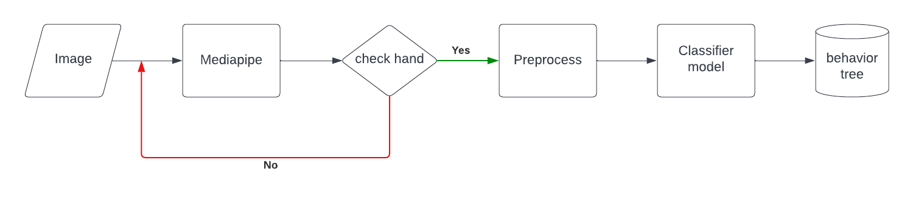
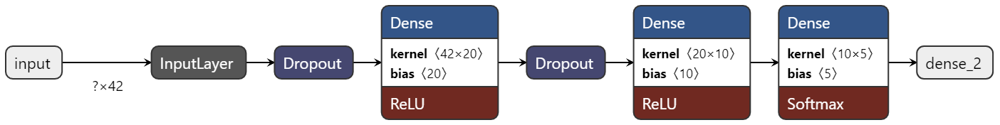

.. _gesture_perception:

Gesture Perception
###################

.. raw:: html

    <h1 align="center">
      

        

          <iframe width="480" height="270" src="https://youtu.be/4Jl3G3RK47c" allowfullscreen></iframe>
        

      

    </h1>

Overview
**********

The purpose of gesture perceptual application for sensing human behavior, living with the human the robot must know human behavior and interact with humans. The posture can specify many things whether emotion, desire, or action so gesture perception is necessary for living with humans. And the minor purpose is to command the robot as we say the posture can specify the desire. The basic way to command the robot is the posture and we can adjust the special command following the desire of the developer however it depends on the suitability to use in real life

Installation
*************
1. CV bridge LTS on ubuntu

    .. code-block:: bash

        sudo apt-get install ros-(ROS version name)-cv-bridge
        sudo apt-get install ros-(ROS version name)-vision-opencv

2. Tensorflow==2.9.1

    see the installation reference on this link: https://www.tensorflow.org/install

Example
*********

- first clone the repository from GitHub following this command

    .. code-block:: bash

      git clone https://github.com/MBSE-2022-1/Software-Team.git -b gesture-perception

- Build the package (navigate to workspace directory before build)

    .. code-block:: bash

      colcon build --symlink-install

    .. note:: 

      always navigate to workspace directory before build and symlink-install is necessary
      
- Run the package

    .. code-block:: bash

      ros2 run gesture_detection gesturedetection.py

- Call service

    .. code-block:: bash

      ros2 service call <service name> std_srvs/srv/Empty

API Reference
***************

The gesture detection function consist of image subscriber, extract image feature, preprocessing and classifier model

Mediapipe
""""""""""""

the image feature is extracted by mediapipe library Mediapipe hand landmarks are composed of x, y, and z. x and y are normalized to [0.0, 1.0] by the image width and height respectively. z represents the landmark depth with the depth at the wrist being the origin, and the smaller the value the closer the landmark is to the camera. The magnitude of z uses roughly the same scale as x. The preprocessing function will set the wrist position as the origin point and then subtract the other 20 points from the origin point then normalize the position 

See the reference API here: https://google.github.io/mediapipe/solutions/hands.html#python-solution-api

Function API reference
""""""""""""""""""""""""

.. highlight:: bash
   :linenothreshold: 1

A cool bit of code::

   #!/bin/bash
   # Some cool Bash code
   echo ${BASH_VERSINFO[*]}

.. highlight:: none

.. code-block:: rst
   :caption: Documentation

   A bit of **rst** which should be *highlighted* properly.

.. code-block:: python
   :caption: Script
   :linenos:

   import sys
   sys.exit(1)

  

Classifier model architecture
""""""""""""""""""""""""""""""

Input: 42 length arrays

Output: hand class ['Open', 'Start_cmd', 'Pointer', 'Close', 'OK']

Problem and future plan
*************************

kiki
