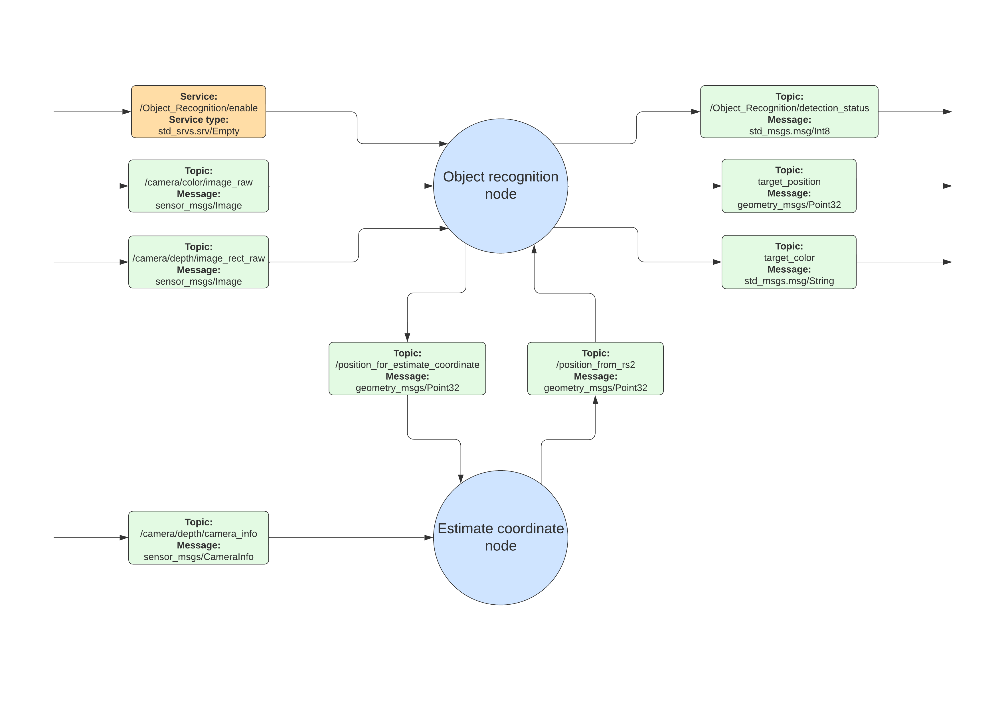

.. _object_perception:

Object Perception
#####################

.. raw:: html

    <h1 align="center">
      

        

          <iframe width="560" height="315" src="https://www.youtube.com/embed/N3PM2mLBngc" title="YouTube video player" frameborder="0" allow="accelerometer; autoplay; clipboard-write; encrypted-media; gyroscope; picture-in-picture" allowfullscreen></iframe>
        

      

    </h1>

Overview
**********

Object detection is a computer vision technique for locating instances of objects in images or videos. Object detection algorithms typically leverage machine learning or deep learning to produce meaningful results. When humans look at images or video, we can recognize and locate objects of interest within a matter of moments. The goal of object detection is to replicate this intelligence using a computer.

Node architecture
""""""""""""""""""

    Figure 1: Object recognition node architecture

This node architecture has 3 topic inputs and 1 service

::

    Topic
    
        - /camera/color/image_raw Message: sensor_msgs/Image
  
            It is intended for receiving each frame image from the camera for use in detecting the object, the value is passed to the Object recognition node.

        - /camera/depth/image_rect_raw Message: sensor_msgs/Image

            It is intended for getting the depth value of each pixel from the camera to estimate the depth of the object in real-world coordinates, the value is passed to the Object recognition node.

        - /camera/depth/camera_info Message: sensor_msgs/CameraInfo

            It is intended for getting matrices and various parameters of the camera model from the camera to estimate the position of the object in real world coordinates, the value is passed to the Estimate coordinate node.

There are 2 topics for sending values between Object recognition node and Estimate coordinate node

:: 

    Topic

        - /position_for_estimate_coordinate Message: geometry_msgs/Point32

            It is intended for sending the coordinate position in the pixel and the depth of that pixel to estimate the position of the object in real world coordinates through the Estimate coordinate node.

        - /position_from_rs2 Message: geometry_msgs/Point32

            It is intended for getting the in real world coordinate position that is obtained from calculations in the Estimate coordinate node.

There are 3 result topics

::

    Topic

        - /Object_Recognition/detection_status Message: std_msgs.msg/Int8

            It is intended for sending the working status of the Object recognition node.

        - /target_position Message: geometry_msgs/Point32

            It is intended for sending the position (x, y, z) in the real world coordinate of the detected object.

        - /target_color Message: std_msgs.msg/String

            It is intended for sending the color value of the detected object.

.. note:: 

    Addition: Due to a device limitation, Jetson Xavier does not currently support the pyrealsense2 library, so we are splitting the working node into two nodes: the Object recognition node running on Jetson Xavier and the Estimate coordinate node running on the Nuc so that the system able to continue working.

Knowledge & Tools
""""""""""""""""""

1. OpenCV and cv_bridge library

    OpenCV (Open Source Computer Vision Library) is an open source computer vision and machine learning software library. OpenCV was built to provide a common infrastructure for computer vision applications and to accelerate the use of machine perception in the commercial products. Being an Apache 2 licensed product, OpenCV makes it easy for businesses to utilize and modify the code.
    https://opencv.org/about/

    Therefore, we use the openCV and cv_bridge libraries to handle the frames of images obtained from the camera in ROS.
    Example usage of sending and receiving image frames between nodes:
    https://automaticaddison.com/getting-started-with-opencv-in-ros-2-foxy-fitzroy-python/

2. Object detection - YOLOv5

    You Only Look Once (YOLO) is one of the most popular model architectures and object detection algorithms. It uses one of the best neural network architectures to produce high accuracy and overall processing speed, which is the main reason for its popularity. If we search Google for object detection algorithms, the first result will be related to the YOLO model.

    YOLO algorithm aims to predict a class of an object and the bounding box that defines the object location on the input image. It recognizes each bounding box using four numbers:

    - Center of the bounding box (b_x, b_y)
    - Width of the box (b_w)
    - Height of the box (b_h)

    In addition to that, YOLO predicts the corresponding number c for the predicted class as well as the probability of the prediction (P_c)

    source: https://www.baeldung.com/cs/yolo-algorithm

    In the Object Recognition node, we use YOLOv5 to detect objects, which results in a frame of the image containing the bounding box and a data frame of the detected object.

    .. figure:: ./images/object_bounding_box.png
        :width: 480
        :align: center
        :alt: YOLOv5_bounding_box

        Figure 2: YOLOv5_bounding_box

|

    There is an YOLOv5 official link here: https://github.com/ultralytics/yolov5
    
    Basic object detection with YOLOv5 tutorial: https://www.youtube.com/watch?v=tFNJGim3FXw

3. Color detection - HSV color model

    An HSV color model is the most accurate color model as long as the way humans perceive colors. How humans perceive colors is not like how RGB or CMYK make colors. They are just primary colors fused to create the spectrum. 

    This is the reason why we use the HSV color model for color detection. 

    The H stands for Hue, S stands for Saturation, and the V stands for value.

    
    - Hue: Hue tells the angle to look at the cylindrical disk. The hue represents the color. The hue value ranges from o to 360 degrees.
    
    - Saturation: The saturation value tells us how much quantity of respective color must be added. A 100% saturation means that complete pure color is added, while a 0% saturation means no color is added, resulting in grayscale. 
    
    - Value: The value represents the brightness concerning the saturation of the color. The value 0 represents total black darkness, while the value 100 will mean a full brightness and depend on the saturation.

    source: https://www.geeksforgeeks.org/hsv-color-model-in-computer-graphics/

    .. figure:: ./images/HSV_color.png
        :width: 480
        :align: center
        :alt: HSV_color

        Figure 3: HSV color

|

    You can see the color values obtained by adjusting various HSV values at the link: https://color.lukas-stratmann.com/color-systems/hsv.html
    
    Since the image frame we received is based on the BGR color model, we need to convert the image frame to the HSV color model, which can be converted using the OpenCV library.

    Then we can use the HSV color model to create the conditions for detecting different colors in the Object recognition node.

    Color conversion tutorial using the OpenCV library: https://docs.opencv.org/4.x/df/d9d/tutorial_py_colorspaces.html

    Basic color detection with HSV color model tutorial: https://www.youtube.com/watch?v=t71sQ6WY7L4

4. Depth map - Intel realsense Depth camera D455

    The Intel realsense Depth camera D455 uses Structured Light or Coded Light technology combined with Stereo Depth technology to find depth maps.

    .. figure:: ./images/what_is_color_depth.jpg
        :width: 480
        :align: center
        :alt: what_is_color_depth

        Figure 4: what_is_color_depth

|

    **Structured light and coded Light depth cameras** are not identical but similar technologies. They rely on projecting light (usually infrared light) from some kind of emitter onto the scene. The projected light is patterned, either visually or over time, or some combination of the two. Because the projected pattern is known, how the sensor in the camera sees the pattern in the scene provides the depth information. For example, if the pattern is a series of stripes projected onto a ball, the stripes would deform and bend around the surface of the ball in a specific way.

    If the ball moves closer to the emitter, the pattern would change too. Using the disparity between an expected image and the actual image viewed by the camera, distance from the camera can be calculated for every pixel.

    .. figure:: ./images/how_coded_light_works-1.jpg
        :width: 480
        :align: center
        :alt: how_coded_light_works-1

        Figure 5: how_coded_light_works-1

|

    **Stereo depth cameras** have two sensors, spaced a small distance apart. A stereo camera takes the two images from these two sensors and compares them. Since the distance between the sensors is known, these comparisons give depth information. Stereo cameras work in a similar way to how we use two eyes for depth perception. Our brains calculate the difference between each eye. Objects closer to us will appear to move significantly from eye to eye (or sensor to sensor), where an object in the far distance would appear to move very little.

    Because stereo cameras use any visual features to measure depth, they will work well in most lighting conditions including outdoors. The addition of an infrared projector means that in low lighting conditions, the camera can still perceive depth details

    .. figure:: ./images/how_stereo_depth_works.jpg
        :width: 480
        :align: center
        :alt: how_stereo_depth_works

        Figure 6: how_stereo_depth_works

|

    source: https://www.intelrealsense.com/beginners-guide-to-depth/

    Since the Intel realsense Depth camera D455 can send a depth frame as an output, we can retrieve the depth value from that depth frame. This process occurs in the Object recognition node.

5. Estimate real world position

    After obtaining the position of the detected object in the pixel coordinate and the depth of that pixel position, we can use the knowledge of Camera Calibration and 3D Reconstruction. Then solve the equations to find the position in the real world coordinate from these values.

    .. figure:: ./images/xyz_pinhole_camera_coordiantes.jpg
        :width: 480
        :align: center
        :alt: xyz_pinhole_camera_coordiantes

        Figure 7: xyz_pinhole_camera_coordiantes

|

    Which can be read and understood from the article according to this link: https://www.fdxlabs.com/calculate-x-y-z-real-world-coordinates-from-a-single-camera-using-opencv/

    Another source that can make you understand more clearly:
    https://www.mathworks.com/help/vision/ug/camera-calibration.html
    https://calib.io/blogs/knowledge-base/camera-models

    But in this case, we will use the pyrealsense2 library, which is a ready-made library to locate real-world coordinates. by defining position in pixel coordinates the depth of that pixel and other parameters of the camera model.

    You can see examples of usage from: https://medium.com/@yasuhirachiba/converting-2d-image-coordinates-to-3d-coordinates-using-ros-intel-realsense-d435-kinect-88621e8e733a

Installation
*************

1. Setup environment.

    - First create a workspace directory.

        .. code-block:: bash
            
            cd
            mkdir object_detection_ws
            cd object_detection_ws/
            mkdir src
            cd src/

    - Clone the repository from GitHub into object_detection_ws/src/

        .. code-block:: bash
            
            git clone https://github.com/MBSE-2022-1/Software-Team.git -b Object-perception

    - Build object_detection package.

        .. code-block:: bash

            cd .. 
            colcon build --symlink-install
            source ~/object_detection_ws/install/setup.bash
            cd src/Software-Team/object_detection/scripts/
            sudo chmod 777 * 

    .. note:: 

        symlink-install is necessary.

    .. warning:: 

        must build in object_detection_ws/

    - Install library

        .. code-block:: bash

            cd ..
            cd src/
            pip install -r object_detection_requirements.txt
            sudo apt-get install ros-(ROS version name)-cv-bridge
            sudo apt-get install ros-(ROS version name)-vision-opencv

    

2. Verify library and object_detection package with basic node.

 .. code-block:: bash

    cd
    cd object_detection_ws/
    ros2 run object_detection webcam_pub.py
    ##### open new terminal
    ros2 run object_detection simple_detection.py

.. raw:: html

    <h1 align="center">
      

        

          <iframe width="560" height="315" src="https://www.youtube.com/embed/O94_Kkg5zg4" title="YouTube video player" frameborder="0" allow="accelerometer; autoplay; clipboard-write; encrypted-media; gyroscope; picture-in-picture" allowfullscreen></iframe>
        

      

    </h1>

Example
*********

In this example The scope of work is

- Use the Intel Depth Camera to send RGB frames and depth frames.
- The ability to detect objects and the number of detected object types depends on the YOLOv5s6 model.
- The maximum detection distance is about 5 meters.

You can try to use it with the following steps

1. Connect the Intel depth camera D435 to the computer and activate it via command

    .. code-block:: bash
        
        ros2 launch realsense2_camera rs_launch.py rgb_camera.profile:=640x480x30 depth_module.profile:=640x480x30

	.. note:: 
        The wrapper for Intel realsense cameras must be installed in ROS first. You can install it by following this link: https://docs.google.com/document/d/1IxUOK6chtMRrF6d4xHHuAmMR7w3yuLYyA5rUxMGGZgI

2. Open new terminal and cd to workspace director.

    .. code-block:: bash

        cd
        cd object_detection_ws/

3. Run the Object recognition node.

    .. code-block:: bash

        ros2 run object_detection object_detection_node.py

4. Open a new terminal and run the Estimate coordinate node.

    .. code-block:: bash

        ros2 run object_detection estimate_coordinate_rs2.py

5. Open a new terminal and call a service to start detecting objects.

    .. code-block:: bash

        ros2 service call /Object_Recognition/enable std_srvs/srv/Empty

.. raw:: html

    <h1 align="center">
      

        

          <iframe width="560" height="315" src="https://www.youtube.com/embed/N3PM2mLBngc" title="YouTube video player" frameborder="0" allow="accelerometer; autoplay; clipboard-write; encrypted-media; gyroscope; picture-in-picture" allowfullscreen></iframe>
        

      

    </h1>

.. note:: 

    You can change the detection target by editing the self.target variable in the object_detection_node.py file.

    The target name of the self.target variable must match the name of the result model YOLOv5 detects.

API Reference
***************

.. rst:directive:: ability_action(self):

    This is the main function of the Object Recognition node. It works only when enabled through the server. Inside the function, the image frame of each frame is imported into the YOLOv5 model, and the result is displayed as a whole image with a bounding box. and result data as a dataframe, and there will be conditions for detection.If the above conditions are met the function will pass the pixel coordinate position and the depth of that pixel to the Estimate coordinate node to find the in real world coordinate of the detected object.
    
    Throughout the operation of this function, the operating status of the system is updated at all times.

.. rst:directive:: update(self):

    This function is for updating the location, depth, and color of detected objects to local variables.

.. rst:directive:: results_addition(self,df,frame,target):

    This is a function for manipulating a dataframe of outputs from model YOLOv5. It adds position column and color column to the dataframe and then only selects the outputs based on the specified target.

    :parameters:
    
        df: The result of object detection of model YOLOv5 in the form of a dataframe.
        
        frame: Color image frame.
        
        target: list of targets to detect.

    :return:

        df_target: result dataframe modified.

.. rst:directive:: color_detection(self,frame,x,y):

    This is a function for detecting the color of the detected object.

    :parameters:
    
		frame: Color image frame.

		x: Position in x-axis in pixel coordinates of the detected object.

		y: Position in y-axis in pixel coordinates of the detected object.

    :return:

        color: The color of the detected object.

.. rst:directive:: convert_depth_to_phys_coord_using_realsense(self, x, y, depth, cameraInfo):

    A function for finding the in the real world coordinate position of the detected object.

    :parameters:
    
        x: Position in x-axis in pixel coordinates of the detected object.
	    
        y: Position in y-axis in pixel coordinates of the detected object.
	    
        depth: The pixel depth of the detected object.
	    
        cameraInfo: Camera parameters of camera model in Intel depth camera D455.

    :return:

        result: Position in real world coordinates of the detected object.

Subsystem Verification
************************

1. Object detection distance.

    From the experiment it was found that The maximum distance that model YOLOv5 can detect is about 5 meters. If the distance is exceeded it will make it difficult to detect objects.

.. raw:: html

    <h1 align="center">
      

        

          <iframe width="560" height="315" src="https://www.youtube.com/embed/AewgfPBv4f0" title="YouTube video player" frameborder="0" allow="accelerometer; autoplay; clipboard-write; encrypted-media; gyroscope; picture-in-picture" allowfullscreen></iframe>
        

      

    </h1>

2. Object detection precision.

    From the experiment it was found that in object detection The same object can produce different detection results. Depends on the detection angle.

.. raw:: html

    <h1 align="center">
      

        

          <iframe width="560" height="315" src="https://www.youtube.com/embed/4FKPDm1IepU" title="YouTube video player" frameborder="0" allow="accelerometer; autoplay; clipboard-write; encrypted-media; gyroscope; picture-in-picture" allowfullscreen></iframe>
        

      

    </h1>

3. Material of object.

    From the experiment it was found that transparent objects It may be difficult to estimate the distance between the subject and the camera.

In this unit testing detection performance including the accuracy of the detected location have not been tested. 

Problem and future plan
*************************

1. Problem

    - The service that has been made can only be used in object detection capabilities. But if combined with other abilities, there will be problems. It is expected that there was a problem while building the package (CMakeLists.txt).

2. Futer Plan

    - **Algorithm** 
	
        The working process and internal functions are not as good as they should be. It can be developed to be more systematic and more optimized.

    - **Training**
	
        It is possible to train models from custom data sets to increase the efficiency of detecting objects of interest. You can use Roboflow to help manage trains.

        Roboflow: https://roboflow.com/
        
        Roboflow Universe: https://universe.roboflow.com/

        learning source: https://www.youtube.com/watch?v=0GwnxFNfZhM
        https://www.youtube.com/watch?v=-QWxJ0j9EY8

3. YOLOv7

    We can switch to model YOLOv7 because YOLOv7 has better object detection performance. and in use can apply knowledge from using YOLOv7.

    There is an YOLOv7 official link here: https://github.com/WongKinYiu/yolov7

4. Color Clustering
   
	Because at present, only one pixel is used to detect the color of the object, which may cause color detection to be inaccurate. So we have to develop such detection. Clustering of color detection may be performed instead.

5. Pose estimate (position + orientation)
   
	We can find the Pose of the object being detected. In order to pick up objects better. It may use the position in the real world coordinates obtained to estimate the next Pose or may use the pointcloud to estimate.

