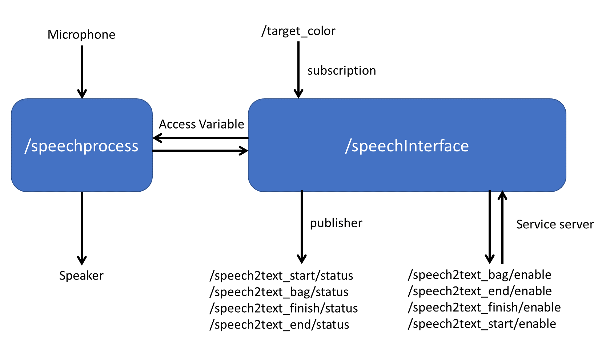
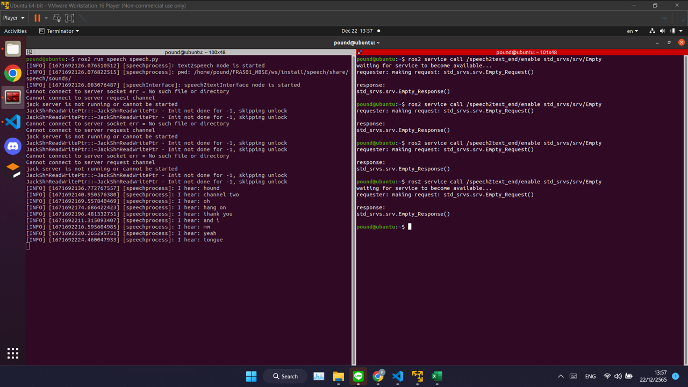
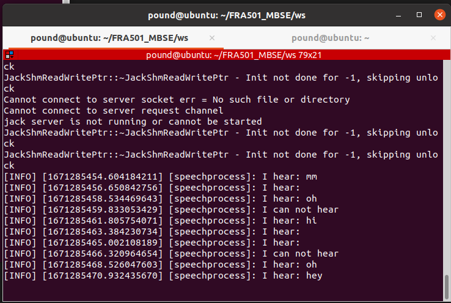

.. _speech_perception:

Speech Perception
#####################

.. raw:: html

    <h1 align="center">
      

        

          <iframe width="560" height="315" src="https://www.youtube.com/embed/4H2NkHMDs6I" title="YouTube video player" frameborder="0" allow="accelerometer; autoplay; clipboard-write; encrypted-media; gyroscope; picture-in-picture" allowfullscreen></iframe>
        

      

    </h1>

Overview
**********

Speech perception consists of  2 system Speech recognition and Speech systesis

Speech recognition is a technologies that enable the recognition and translation of spoken language into text by computers with the main benefit of searchability. It is also known as computer speech recognition or speech to text (STT).

Speech systesis is a computer system used for this purpose is called a speech synthesizer, and can be implemented in software or hardware products. A text-to-speech (TTS) system converts normal language text into speech;

Architecture
""""""""""""""

|

Speech perception consists of 2 node 1 for process algorithm and 1 for interfacev

It have 4 service server and 5 topic

::
    - service

        Name : /speech2text_start/status Type: std_srvs.srv/Empty
        
            It use to enable node to do start task and play sound

        Name : /speech2text_bag/status Type: std_srvs.srv/Empty

            It use to enable node to confirm color of bag

        Name : /speech2text_finish/status Type: std_srvs.srv/Empty

            It use to enable node check when user arrive at the destination

        Name : /speech2text_end/status Type: std_srvs.srv/Empty

        It use to enable node to finish task

    - Topic:
    
        Name : /speech2text_start/status Type: std_msg.msg/Int8
    
            It publish status of start task
    
        Name : /speech2text_bag/status Type:std_msg.msg/Int8
    
            It publish status of bag task
    
        Name : /speech2text_finish/status Type: std_msg.msg/Int8
    
            It publish status of finish task
    
        Name : /speech2text_end/status Type: std_msg.msg/Int8
    
            It publish status of end task
    
        Name : /target_color Type: std_msg.msg/string
    
            It subscription color of bag from object perception

Layout Package
""""""""""""""""

| Speech
| ├── Speech
| │   └── __init__.py
| ├── scripts
| │   └── speech.py
| ├── CMakeList.txt
| ├── package.xml
| ├── sound
| │     ├── arrived.mp3
| │     └──I can't hear you.mp3
| └── README.md

Concept
""""""""

- Node speech process

    It will receive command from speechInterface and process it the main function are

    - callSpeak : It will call speak function to play sound file that already synthesized from gtts if it can not find the file it will use pyttsx3 to synthesis the sound

    .. code-block:: python

        def callSpeak(self, msg):
        #try to find the file in the path and play it
            try:
                playsound(self.path + msg + '.mp3')
            except:
                self.get_logger().info('can not find the file')
                self.engine.say(msg)
                self.engine.runAndWait()
    
    - listen : It will listen to microphone and convert it to text by using sphinx and speech recognition and return the text

    .. code-block:: python

        def listen(self):
            try:
                r = sr.Recognizer()
                with sr.Microphone() as source:
                    audio = r.listen(source, timeout = self.timeout, phrase_time_limit = self.phrase_time_limit)
                    text = r.recognize_sphinx(audio)
                    self.get_logger().info('I hear: %s' % text)
                    if(text == ''):
                        text = 'Empty string'
                    text.lower()
                    return text
            except sr.UnknownValueError:
                self.get_logger().info('I can not hear')
                return ''
            except sr.RequestError as e:
                self.get_logger().info('I can not hear')
                return ''

    - timer callback: It will check if there is command to enable each ability and if there have command it will start to publish data

    .. code-block:: python

        def timer_callback(self):
            if(self.first_time_finish == True):
                self.first_time_finish = False
                self.isEnable_finish = True
                self.FinishFunction()
            elif(self.first_time_bag == True):
                self.first_time_bag = False
                self.isEnable_bag = True
                self.BagFunction()
            elif(self.first_time_start == True):
                self.first_time_start = False
                self.isEnable_start = True
                self.StartFunction()
            elif(self.first_time_end == True):
                self.first_time_end = False
                self.isEnable_end = True
                self.EndFunction()

- Node speechInterface

    It will be service server to receive command and adjust parameter of node speechprocess and it will be publisher to send status of each ability

    .. code-block:: python

        def speech2TextBagCallback(self, request, response):
            self.control.first_time_bag = True
            return response
        def publish(self):
            if(self.control.isEnable_bag):
                self.pub_speech2textBag.publish(self.control.param_status_bag)
            ....
            if(self.control.param_status_bag.data != 0):
                self.control.isEnable_bag = False
                self.pub_speech2textBag.publish(self.control.param_status_bag)
                self.control.param_status_bag.data = 0

Installation
*************

Python library
""""""""""""""""

- playsound

    .. code-block:: bash

        pip install SpeechRecognition

- speech recognition

    .. code-block:: bash

        pip install SpeechRecognition

- sphinx

    .. code-block:: bash

        pip install pocketsphinx

- pyttsx3

    .. code-block:: bash

        pip install pyttsx3

- gtts

    .. code-block:: bash

        pip install gtts

- pyaudio

    .. code-block:: bash

        pip install pyaudio

Example
*********

1. clone GitHub repository from

    .. code-block:: bash

        git clone https://github.com/MBSE-2022-1/Software-Team.git -b speech perception

2. Open terminal and run following command

    .. code-block:: bash

        colcon build
        source install/setup.bash

    .. note:: Don't build with symlink-install

3. Run command

    .. code-block:: bash

        ros2 run speech speech.py

4. Open new terminal and run command

    .. code-block:: bash

        ros2 service call /speech2text_start/enable std_srvs/srv/Empty

.. API Reference
.. ***************

Subsystem Verification
************************

speech detection with noise environment
""""""""""""""""""""""""""""""""""""""""""""
testing with use speaker from google translate in english language to say yes and thank you to see accuracy of model speech recongition

.. note:: noise environment it is a situation that there have a person talk in the same room  we adding sound form video people talking

- result

.. list-table::
   :widths: 50 30 30
   :header-rows: 1
   :align: center

   * - Number of testing
     - Yes
     - Thank you
   * - 1
     - mm
     - hound
   * - 2
     - error
     - channel two
   * - 3
     - oh
     - oh
   * - 4
     - hi
     - hang on
   * - 5
     - error
     - thank you
   * - 6
     - error
     - and i
   * - 7
     - oh
     - mm
   * - 8
     - yes
     - yeah

|

    result with “yes” word

|

    result with “yes” word

|

word can detection with saying yes,thank you in translate

- Problem

    model speech recognition have low accuaracy it often go wrong word.

Problem and future plan
*************************

**Future Plan**

training model for speech recognition to improve accuracy and speed of recognition and use machine learning to know what the user want to do
