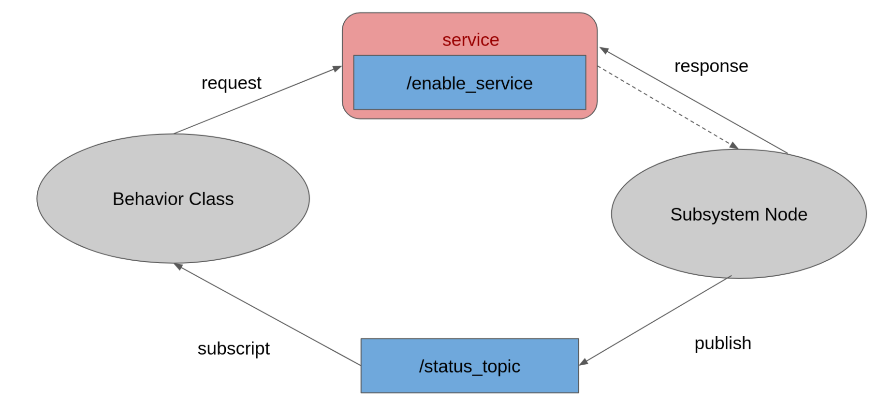

.. _software_integration:

Software Integration
#####################

.. raw:: html

    <h1 align="center">
      

        

          <iframe width="560" height="315" src="https://www.youtube.com/embed/4Jl3G3RK47c" title="YouTube video player" frameborder="0" allow="accelerometer; autoplay; clipboard-write; encrypted-media; gyroscope; picture-in-picture" allowfullscreen></iframe>
        

      

    </h1>

Overview
**********

The software integration path was created to integrate all of the subsystems and control the robot's behavior throughout its work in order for it to be correct, followed by a user story. The behavior can be induced by defining conditions in subsystems. 

Software integration uses behavior trees to create each behavior and make decisions about the robot’s behavior. The first draft of the project uses py_tree and py_tree_ros, Python implementations of behavior trees, to manage the behaviors of the robot. More information about py_tree can be found at https://py-trees.readthedocs.io/en/devel/

The developed behavior tree's structure is divided into three major parts: the root tree, behaviors classes, and subsystem nodes. The root tree was used to create the behavioral flow and call behaviors of the robot. The diagram below (Fig. a) shows the behavior flow of the robot's first draft. Behaviors classes are used to start subsystem nodes with service and receive status feedback from subsystem nodes. The diagram below (Fig. b) will explain correlation of  behavior class and subsystem node.

.. figure:: ./images/sysint_a.png
    :width: 480
    :align: center
    :alt: behavior_flow

    Fig. a shows the behavior flow

|
|

    Fig. b explain correlation of  behavior class and subsystem node

|

Installation
*************

- Install py_tree

    .. code-block:: bash
        
        sudo apt-get install ros-foxy-py-trees

- Install py_tree_ros

    .. code-block:: bash
        
        sudo apt-get install ros-foxy-py-trees-ros

- Test simple behavior tree

    - Setup

        .. code-block:: bash
            
            git clone https://github.com/MBSE-2022-1/Software-Team.git
            cd sample_ws/
            colcon build --symlink-install

    - Run node

        .. code-block:: bash
        
            ros2 run sample_integration node.py

    - Run root node

        .. code-block:: bash
        
            ros2 run sample_integration root_tree.py

    - Result

        https://youtu.be/sjqenN-GnF4

Example
*********

- Setup workspace

    .. code-block:: bash

        git clone https://github.com/MBSE-2022-1/Software-Team.git
        cd demo_ws/
        colcon build --symlink-install

- Setup hardware

  1. Camera

        .. code-block:: bash

            ros2 launch realsense2_camera rs_launch.py \
                    rgb_camera.profile:=640x480x30 \
                    depth_module.profile:=640x480x30 \
                    pointcloud.enable:=true

  2. Wheel odometry

        .. code-block:: bash

		    sudo chown $USERNAME /dev/ttyACM0
		    ros2 run xicro_pkg xicro_node_sub_N_pub_ID_3_stm32.py
		    ros2 run xicro_pkg nav_msg_publisher.py

- Run all subsystem node

    .. code-block:: bash
        
        ros2 launch integrate_system launch_node.launch.py

- Run root node

    .. code-block:: bash
        
        ros2 run integrate_system root.py

Problem and future plan
*************************

- Future Plan

    Manage node initialization and destruction; initialize nodes when they're needed and destroy nodes when they're finished.
